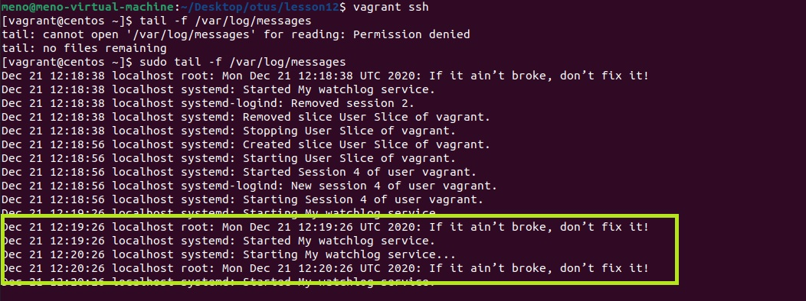
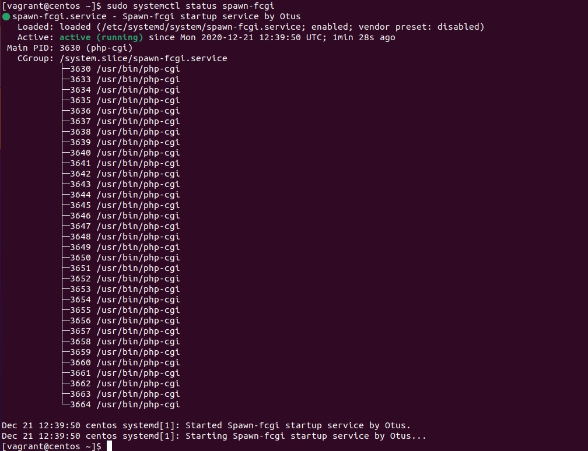
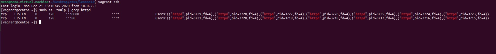

## Lesson 12 (Systemd - Units) 


#### 1. Написать сервис, который будет раз в 30 секунд мониторить лог на предмет наличия ключевого слова. Файл и слово должны задаваться в /etc/sysconfig

**Решение:** 
> в [install.sh](install.sh) раздел - Task Timer

* Создаем файлы [/etc/sysconfig/watchlog](scripts/watchlog), [/var/log/watchlog.log](scripts/watchlog.log) и [/opt/watchlog.sh](scripts/watchlog.sh) 

* /etc/sysconfig/watchlog - файл конфигурации 
* /var/log/watchlog.log - лог файл с содеражнием ключевого слова ‘ALERT’
* /opt/watchlog.sh - скрипт

Создаем UNIT файлы [watchlog.service](scripts/watchlog.service) и [watchlog.timer](scripts/watchlog.timer), перечитываем systemd и стартуем сервисы.



#### 2. Из epel установить spawn-fcgi и переписать init-скрипт на unit-файл. Имя сервиса должно так же называться.

**Решение:** 
> в [install.sh](install.sh) раздел - Task init to unit

Установим необходимые пакеты 

```
yum install epel-release -y && yum install spawn-fcgi php php-cli mod_fcgid httpd -y
```

Раскомментируем опции SOCKET и OPTIONS в /etc/sysconfig/spawn-fcgi и создадим [Unit-файл](scripts/spawn-fcgi.service). 

Перечитываем systemd, запуститим и проверим статус.



#### 3. Дополнить Unit-файл apache httpd возможностьб запустить несколько инстансов сервера с разными конфигами

**Решение:** 
> в [install.sh](install.sh) раздел - Task two httpd

Для запуска нескольких экземпляров сервиса используем шаблон в конфигурации файла окружения. 
Создадим [Unit-файл](scripts/httpd.service) и в качестве конфигурации укажем файл с параметром %I:

```
EnvironmentFile=/etc/sysconfig/httpd-%I
```

В самом файле окружения (в данном примере их два) задаем опцию запуска веб-сервера:

```
# /etc/sysconfig/httpd-first
OPTIONS=-f conf/first.conf
# /etc/sysconfig/httpd-second
OPTIONS=-f conf/second.conf
```
В директории с конфигами httpd должно быть два файла конфигурации: first.conf и second.conf.

Для запуска каждого экземпляра определим уникальный PID и порт (Listen):

```
PidFile /var/run/httpd-second.pid
Listen 8080
```

Отключим запуск оригинального экземпляра httpd, перечитаем systemd и запустим наши два экземпляра. 

Проверим какие порты слушают наши экземпляры httpd


