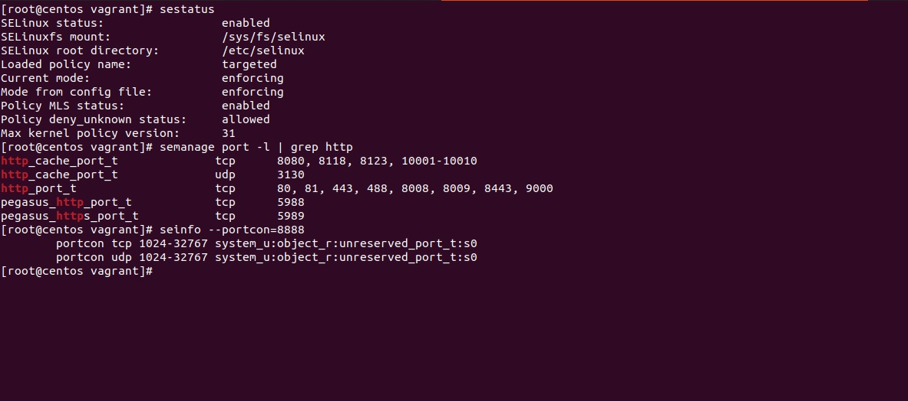
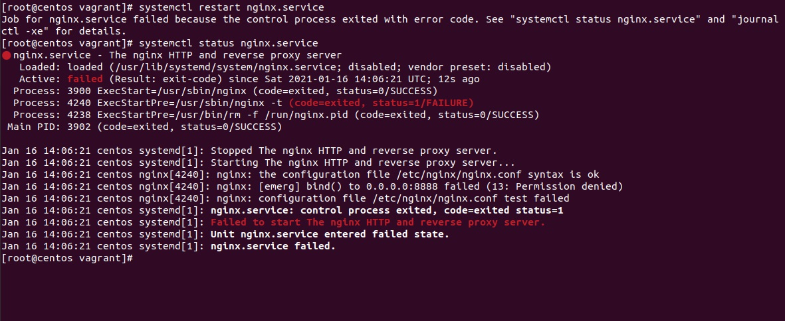
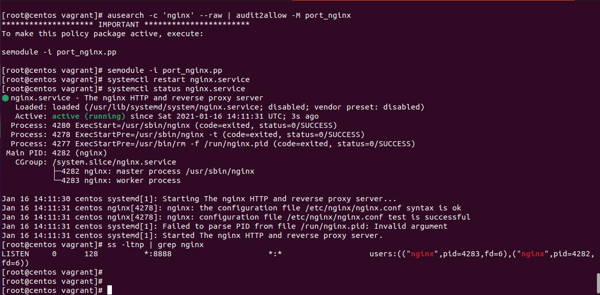
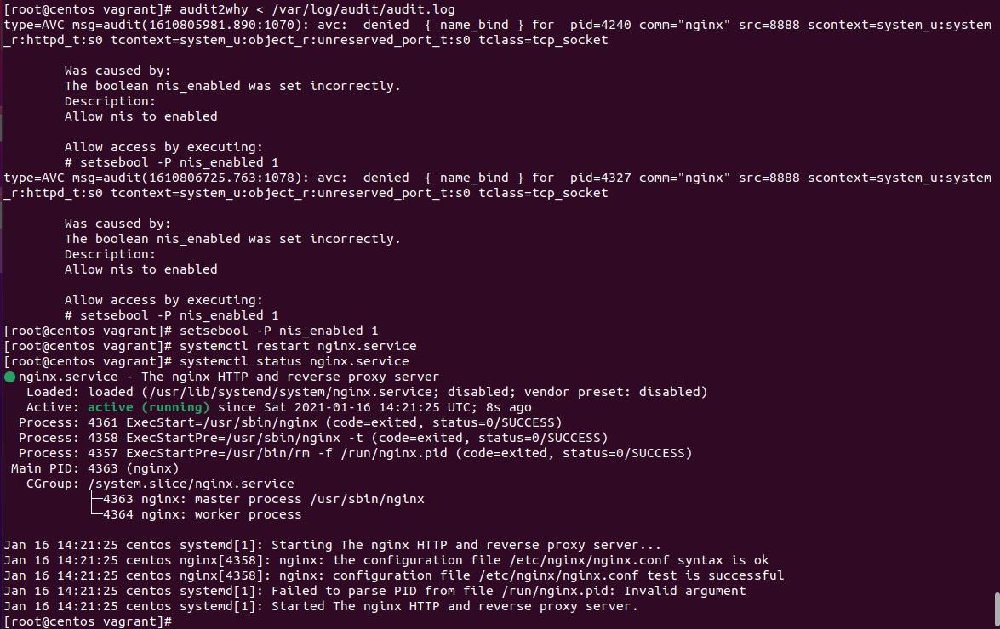
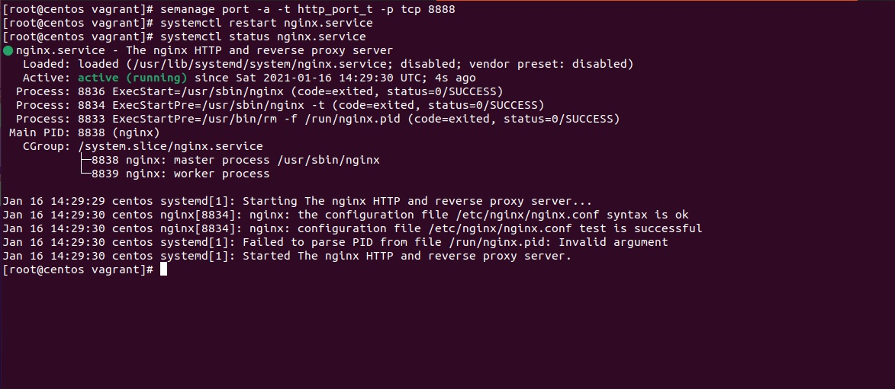
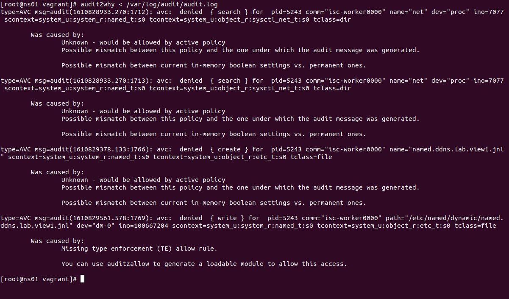
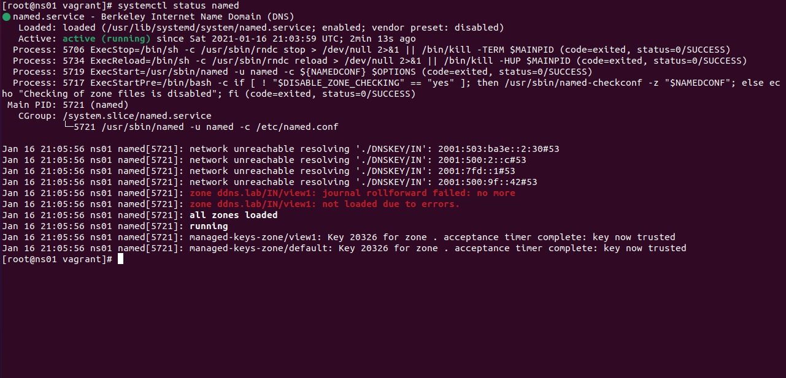
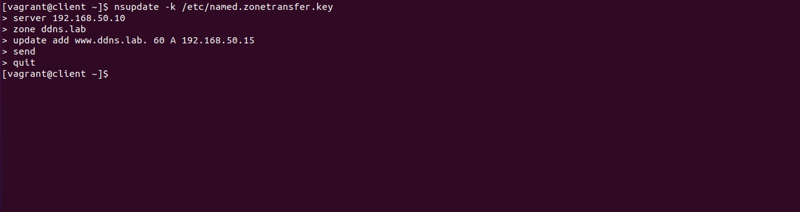

# Lesson 15 (SELinux)

## Задача 1
Запустить nginx на нестандартном порту и 3-мя разными способами:
- формирование и установка модуля SELinux;
- переключатели setsebool;
- добавление нестандартного порта в имеющийся тип.

### Решения

Имеем [рабочий стенд](vagrantfile) с nginx на стандартном порту 80. Для решения поставленной задачи сменим стандартный порт на 8888

1. Проверим что SELinux активен и порт 8888 не входит в стандартные
```
sestatus
semanage port -l | grep http
seinfo --portcon=8888
```


2. Заменим порт Nginx и перезапустим 




#### Решение 1. 

Проанализируем наш audit.log с помощью утилиты ausearch и audit2allow:
```
ausearch -c 'nginx' --raw | audit2allow -M port_nginx
semodule -i port_nginx.pp
```


Отключим модуль для следующего решения и перезапуститм nginx
```
semodule -d port_nginx
systemctl restart nginx.service
```

#### Решение 2. 

Проанализируем наш audit.log с помощью утилиты audit2why и последуем рекомендациям:
```
audit2why < /var/log/audit/audit.log
setsebool -P nis_enabled 1
```


Отключим правило для следующего решения и перезапуститм nginx:
```
getsebool -a | grep nis_enabled
setsebool -P nis_enabled off
systemctl restart nginx.service
```
#### Решение 3. 

Добавим нужный порт в правила SELinux для http_port_t:
```
semanage port -a -t http_port_t -p tcp 8888
```



## Задача 2

Обеспечить работоспособность приложения при включенном selinux.
- Развернуть приложенный стенд - https://github.com/mbfx/otus-linux-adm/tree/master/selinux_dns_problems
- Выяснить причину неработоспособности механизма обновления зоны (см. README);
- Предложить решение (или решения) для данной проблемы;
- Выбрать одно из решений для реализации, предварительно обосновав выбор;
- Реализовать выбранное решение и продемонстрировать его работоспособность.

### Решения

Стенд развернут из предложенного файла -  https://github.com/mbfx/otus-linux-adm/tree/master/selinux_dns_problems

#### Решение 1. 

Для решения задачи будет создано необходимое количество модулей исключений для SELinux. 

Модули будут формироваться из /var/log/audit/audit.log через утилиту audit2allow и ausearch. Решение одной ошибки SELinux порождает другую, поэтому формирование модулей исключений будут происходить один за другим по мере возникновения ошибки. Таже же, ошибки по bind будут анализироваться из лог файла /var/log/messages.


1. Проверим статус SELinux:

```
[root@ns01 vagrant]# sestatus
SELinux status:                 enabled
SELinuxfs mount:                /sys/fs/selinux
SELinux root directory:         /etc/selinux
Loaded policy name:             targeted
Current mode:                   enforcing
Mode from config file:          enforcing
Policy MLS status:              enabled
Policy deny_unknown status:     allowed
Max kernel policy version:      31
```

2. На клиенте произведем требуемое действие:

```
[vagrant@client ~]$ nsupdate -k /etc/named.zonetransfer.key
> server 192.168.50.10
> zone ddns.lab 
> update add www.ddns.lab. 60 A 192.168.50.15
> send
update failed: SERVFAIL
> 
```

3. Проанализируем лог SELinux и произведем рекомендованные действия:

```
audit2why < /var/log/audit/audit.log
audit2allow -M named-selinux --debug < /var/log/audit/audit.log
semodule -i named-selinux.pp
```


Формируем модуль и компилируем.

4. Лог /var/log/messages 

```
[root@ns01 vagrant]# cat /var/log/messages | grep ausearch
Jan 17 06:48:40 10 python: SELinux is preventing /usr/sbin/named from search access on the directory net.#012#012*****  Plugin catchall (100. confidence) suggests   **************************#012#012If you believe that named should be allowed search access on the net directory by default.#012Then you should report this as a bug.#012You can generate a local policy module to allow this access.#012Do#012allow this access for now by executing:#012# ausearch -c 'isc-worker0000' --raw | audit2allow -M my-iscworker0000#012# semodule -i my-iscworker0000.pp#012
```
Выполним рекомендованные действия.

```
ausearch -c 'isc-worker0000' --raw | audit2allow -M my-iscworker0000
semodule -i my-iscworker0000.pp
```
Попробуем с клинета требуемые действия и получим ошибку.

Смотрим далее лог /var/log/messages и выполним очередные предложенные действия, название модуля изменим:
```
ausearch -c 'isc-worker0000' --raw | audit2allow -M my-iscworker0001
semodule -i my-iscworker0001.pp
```
Попробуем с клинета требуемые действия и получим ошибку.

В /var/log/messages получаем очередную ошибку доступа к файлу (/proc/sys/net/ipv4/ip_local_port_range.). Формируем очередной модуль и компилируем:

```
ausearch -c 'isc-worker0000' --raw | audit2allow -M my-iscworker0002
semodule -i my-iscworker0002.pp
```

Смотрим дальше и пока в /var/log/messages не перестанет появлятся ошибка: 

```
ausearch -c 'isc-worker0000' --raw | audit2allow -M my-iscworker0003
semodule -i my-iscworker0003.pp

ausearch -c 'isc-worker0000' --raw | audit2allow -M my-iscworker0004
semodule -i my-iscworker0004.pp
```

5. Ошибок в журнале больше нет, но в статусе named есть ошибки:

```
systemctl ststus named
```



6. Удалим журнал на который ругается и перзапустим 

```
rm /etc/named/dynamic/named.ddns.lab.view1.jnl

systemctl reload named
systemctl status named
```

7. Ошибок нет. Попробуем обновить запись через клиента:



Обновление прошло успешно.

**Выводы:**

Причина неудач во время обновления зоны DNS в том, что SELinux блокировал доступ к файлам DNS сервера, а также к некоторым файлам ОС, к которым /usr/sbin/named обращается во время своей работы.

#### Решение 2. 

Решение будет состоять в изменении контекста безопастности SELinux для необходимых файлов для работы Bind (named).

1. Проверим статус SELinux:

```
[root@ns01 vagrant]# sestatus
SELinux status:                 enabled
SELinuxfs mount:                /sys/fs/selinux
SELinux root directory:         /etc/selinux
Loaded policy name:             targeted
Current mode:                   enforcing
Mode from config file:          enforcing
Policy MLS status:              enabled
Policy deny_unknown status:     allowed
Max kernel policy version:      31
```

2. На клиенте произведем требуемое действие:

```
[vagrant@client ~]$ nsupdate -k /etc/named.zonetransfer.key
> server 192.168.50.10
> zone ddns.lab 
> update add www.ddns.lab. 60 A 192.168.50.15
> send
update failed: SERVFAIL
> 
```


3. Проанализируем лог SELinux:

```
audit2why < /var/log/audit/audit.log


[root@ns01 vagrant]# audit2why < /var/log/audit/audit.log
type=AVC msg=audit(1610868594.755:1713): avc:  denied  { search } for  pid=5218 comm="isc-worker0000" name="net" dev="proc" ino=7077 scontext=system_u:system_r:named_t:s0 tcontext=system_u:object_r:sysctl_net_t:s0 tclass=dir

	Was caused by:
		Missing type enforcement (TE) allow rule.

		You can use audit2allow to generate a loadable module to allow this access.

type=AVC msg=audit(1610868594.755:1714): avc:  denied  { search } for  pid=5218 comm="isc-worker0000" name="net" dev="proc" ino=7077 scontext=system_u:system_r:named_t:s0 tcontext=system_u:object_r:sysctl_net_t:s0 tclass=dir

	Was caused by:
		Missing type enforcement (TE) allow rule.

		You can use audit2allow to generate a loadable module to allow this access.

type=AVC msg=audit(1610868923.759:1767): avc:  denied  { create } for  pid=5218 comm="isc-worker0000" name="named.ddns.lab.view1.jnl" scontext=system_u:system_r:named_t:s0 tcontext=system_u:object_r:etc_t:s0 tclass=file

	Was caused by:
		Missing type enforcement (TE) allow rule.

		You can use audit2allow to generate a loadable module to allow this access.

```

Не может быть создан журнал named.ddns.lab.view1.jnl

4. Определим контекст безопасниости на папку где находится файл журналов:

```
ls -Z /etc/named

chcon -R -u system_u -r object_r -t named_log_t /etc/named/dynamic/
```

После этого клиент может выполянть поставленную задачу.

> Значения контекста для named- https://linux.die.net/man/8/named_selinux

**Выводы:**

Данный способ более лаконичен и, на мой взгляд, более грамотный. Данный способ не требует дополнительных компиляций модулей в ядро, значительных усилий по разборке логов ошибок, присваеваемый контекст безопасности является стандартным для системы.
