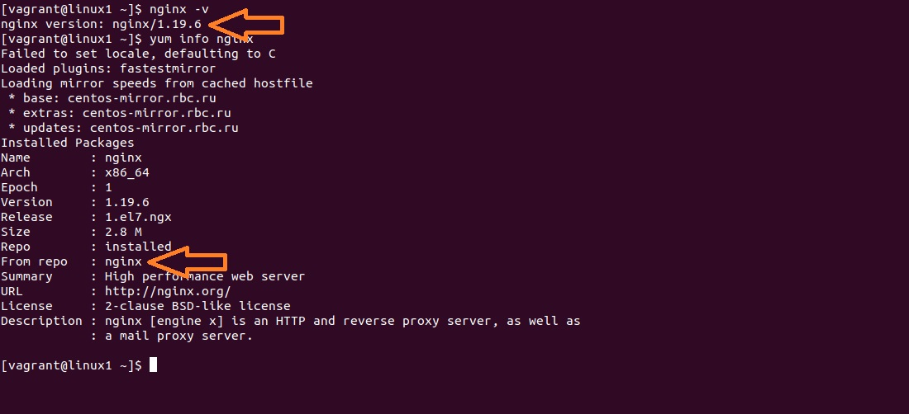
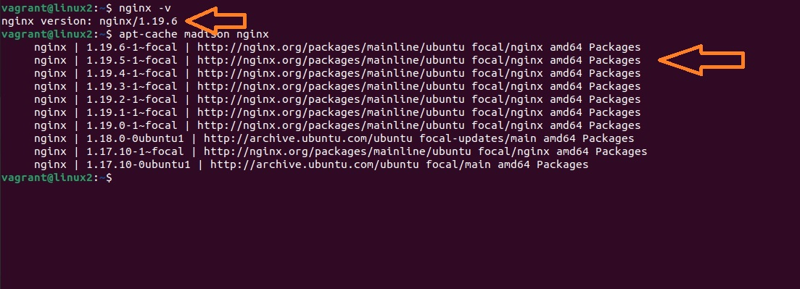

# Lesson 16 (Ansible)

## Разворачиваем NGINX через Ansible

**Условия задачи:**
* необходимо использовать модуль yum/apt;
* конфигурационные файлы должны быть взяты из шаблона jinja2 с перемененными;
* после установки nginx должен быть в режиме enabled в systemd;
* должен быть использован notify для старта nginx после установки;
* сайт должен слушать на нестандартном порту - 8080, для этого использовать переменные в Ansible;
* **установка Nginx с официального репозитория** - условие с занятия.

## Решение

Для решения данной задачи подготовлен стенд на Vagrant с двумя серверами (CentOS 7, Ubuntu 20). Задача резвернуть на разные редакции Linux Nginx из одного playbook-а - **[Vagrant file](vagrantfile)**.

Сетевые настройки хостов:
* linux1 (CentOS) - 192.168.50.11
* linux2 (Ubuntu) - 192.168.50.12

На стендовой машине развернут Ansible.

Поднимем стенд:

```
vagrant up
```

**Результат задачи: достаточно развернуть vagrant файл.**


## Playbook Ansible

**1. Создаем inventory файл**

[Файл Invetory](playbook/invent)

**2. Создаем конфиг файл**

[Файл конфигурации](playbook/ansible.cfg)

**3. Создаем Playbook**

В решении использован метод блочного исполния тасков с условием. Условием является сопоставление переменной аnsible_os_family:

```
ansible all -m setup | grep os_family
```
* CnetOS относится к os_family - RedHat
* Ubuntu относятся к os_family - Debian

Для разворачивания NGINX используем модуль yum и apt для CentOS и Debian соответственно.

Для запуска NGINX на нестандартом порту используем шаблон jinja2 с перемнной nginx_listen_port:

```
  vars:
    nginx_listen_port: 8080
```
и конфиг файл NGINX приведем к виду:

```
server {
        listen       {{ nginx_listen_port }} default_server;
        listen       [::]:{{ nginx_listen_port }} default_server;
        server_name  _;
        root         /usr/share/nginx/html;
```

[Файл nginx.conf](playbook/nginx.conf.j2)


**4. Подключаем репозиторий Nginx**

Для rpm:
```
    - name: Add Nginx Repository for CentOS
      yum_repository:
        name: nginx
        description: NGINX
        file: nginx
        baseurl: https://nginx.org/packages/mainline/centos/$releasever/$basearch/
        gpgcheck: false
        enabled: true
```
и для deb:

```
      - name: Add key for Repository
        apt_key:
          url: http://nginx.org/keys/nginx_signing.key
          state: present

      - name: Install Nginx Repo Debian
        apt_repository:
          repo: deb http://nginx.org/packages/mainline/ubuntu/ {{ ansible_distribution_release }} nginx
          state: present
          filename: nginx.list
          update_cache: true
      
      - name: Update apt 
        apt:
          update_cache: true 

```

**5. Запускаем через systemd**

Чтоб NGINX был запущен:

```
service: name=nginx state=started enabled=yes
```

Через systemd:

```
  systemd:
      name: nginx
      state: restarted
      enabled: true
```

[Файл playbook](playbook/playbook.yml)

**6. Тестируем**

```
ansible-playbook playbook/playbook.yml
```

На обеих хостах стартовая страница Nginx будет доступна на порту 8080.

## Ansible Roles

**1. Создаем роль**

```
mkdir roles
ansible-galaxy init deploy_nginx
```

Будет создана директория deploy_nginx с иерархией:

```
tree roles

roles
└── deploy_nginx
    ├── defaults
    │   └── main.yml
    ├── files
    ├── handlers
    │   └── main.yml
    ├── meta
    │   └── main.yml
    ├── README.md
    ├── tasks
    │   └── main.yml
    ├── templates
    │   └── nginx.conf.j2
    └── vars
        └── main.yml

```

**2. Перенос блоков нашего playbook.yml в иерархию roles**


**3. Создаем playbook для нашей роли**


Создаем в рядом с директорией roles наш playbook файл:

```
---
- name: Otus Lesson Ansible
  hosts: all
  become: true

  roles: 
    - deploy_nginx
```
[Файл playbook](provision/playbook-nginx.yml)

**4. Тестируем**

```
ansible-playbook provision/playbook-nginx.yml
``` 
На обеих хостах стартовая страница Nginx будет доступна на порту 8080, версии Nginx идентичны и установлены с официального репозитория. 

Для CentOS:


Для Ubuntu:

