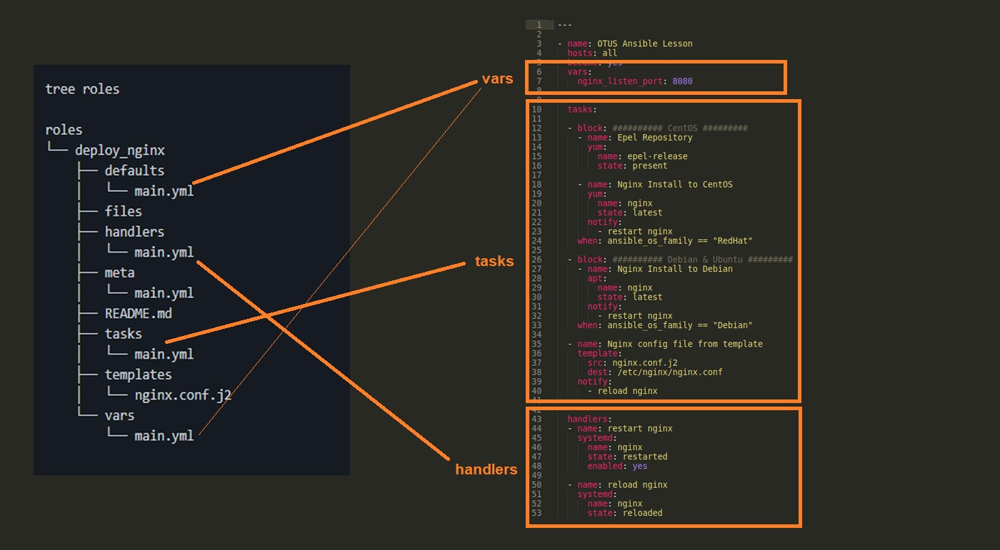

# Lesson 16 (ANSIBLE)

## Разворачиваем NGINX через Ansible

**Условия задачи:**
* необходимо использовать модуль yum/apt
* конфигурационные файлы должны быть взяты из шаблона jinja2 с перемененными
* после установки nginx должен быть в режиме enabled в systemd
* должен быть использован notify для старта nginx после установки
* сайт должен слушать на нестандартном порту - 8080, для этого использовать переменные в Ansible

## Решение

Для решения данной задачи подготовлен стенд на Vagrant с тремя серверами (CentOS 7, Ubuntu 20, Debian 10). Задача резвернуть на разные редакции Linux Nginx из одного playbook - [Vagrant file](vagrantfile).

Сетевые настройки хостов:
* linux1 (CentOS) - 192.168.50.11
* linux2 (Ubuntu) - 192.168.50.12
* linux3 (Debian) - 192.168.50.13

На стендовой машине развернут Ansible и получит адрес 192.168.50.1

Поднимем стенд:

```
vagrant up
```

**Решение задачи: достаточно развернуть vagrant файл**


### Playbook Ansible

**Создаем inventory файл**

[Файл Invetory](playbook/invent)

**Создаем конфиг файл**

[Файл конфигурации](playbook/ansible.cfg)

**Создаем Playbook**

В решении использован метод блочного исполния тасков с условием. Условием является сопоставление переменной аnsible_os_family:

```
ansible all -m setup | grep os_family
```
CnetOS относится к os_family - RedHat
Ubuntu и Debian относятся к os_family - Debian

Для разворачивания NGINX используем модуль yum и apt для CentOS и Debian соответственно.

Для запуска NGINX на нестандартом порту используем шаблон jinja2 с перемнной nginx_listen_port:

```
  vars:
    nginx_listen_port: 8080
```
и конфиг файл NGINX приведем к виду:

```
server {
        listen       {{ nginx_listen_port }} default_server;
        listen       [::]:{{ nginx_listen_port }} default_server;
        server_name  _;
        root         /usr/share/nginx/html;
```

[Файл nginx.conf](playbook/nginx.conf.j2)


Чтоб NGINX был запущен:

```
service: name=nginx state=started enabled=yes
```

Через systemd:

```
  systemd:
      name: nginx
      state: restarted
      enabled: yes
```

[Файл playbook](playbook/playbook.yml)

**Тестируем**

```
ansible-playbook playbook/playbook.yml
```

На всех трех хостах стартовая страница Nginx будет доступна на порту 8080.

### Ansible Roles

**Создаем роль**

```
mkdir roles
ansible-galaxy init deploy_nginx
```

Будет создана папка deploy_nginx и иерархией


```
tree roles

roles
└── deploy_nginx
    ├── defaults
    │   └── main.yml
    ├── files
    ├── handlers
    │   └── main.yml
    ├── meta
    │   └── main.yml
    ├── README.md
    ├── tasks
    │   └── main.yml
    ├── templates
    │   └── nginx.conf.j2
    └── vars
        └── main.yml

```
Перенесм блоки нашего playbook.yml в иерархию roles



Создаем playbook-nginx.yml для нашей роли:

```
---
- name: Otus Lesson Ansible
  hosts: all
  become: yes

  roles: 
    - deploy_nginx
```

**Тестируем**

```
ansible-playbook provision/playbook-nginx.yml
``` 
На всех трех хостах стартовая страница Nginx будет доступна на порту 8080.