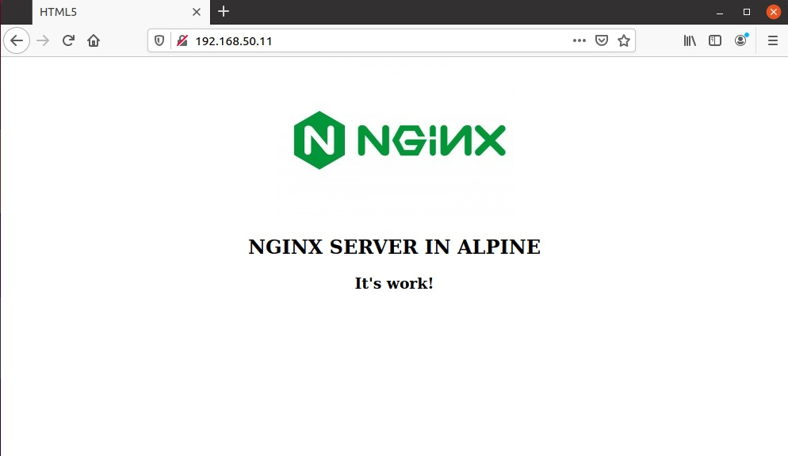
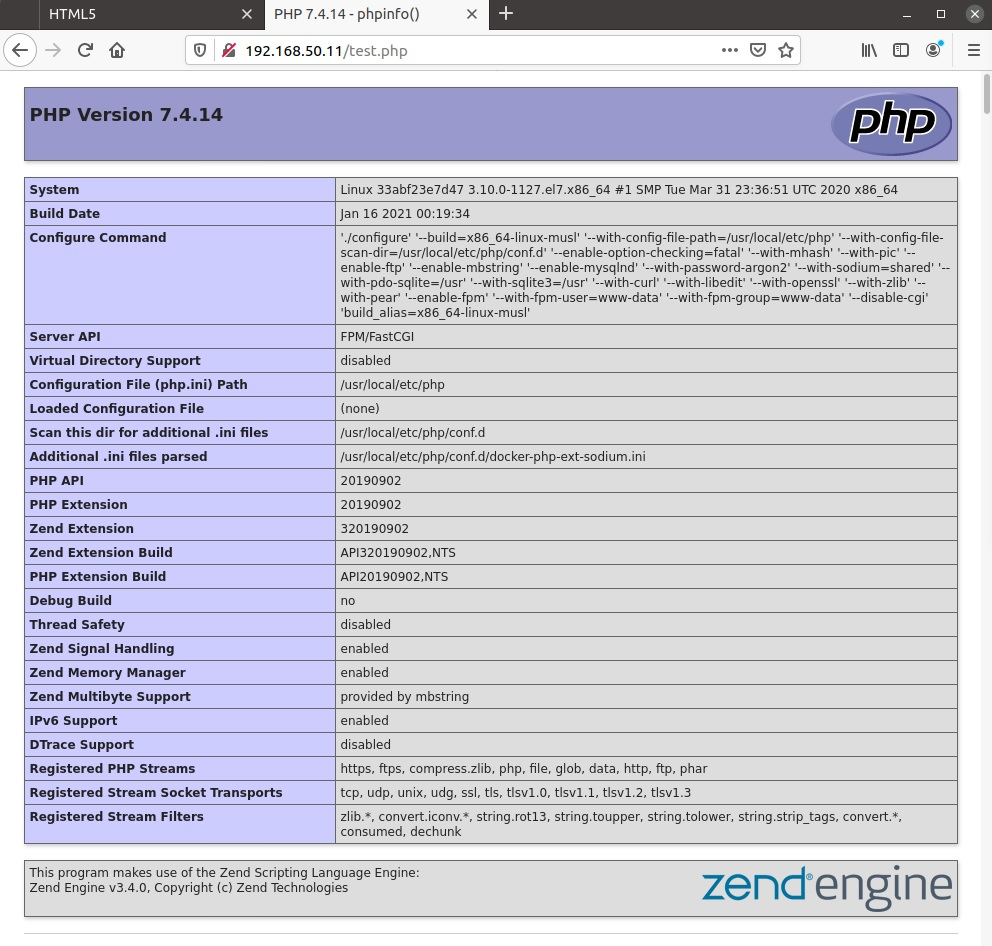

# Lesson 19 (Docker)

## Задача 1

* Создать кастомный образ nginx на базе alpine. После запуска nginx должен отдавать кастомную страницу (достаточно изменить дефолтную страницу nginx);
* Определите разницу между контейнером и образом;
* Ответить на вопрос: Можно ли в контейнере собрать ядро?
* Собранный образ необходимо запушить в docker hub и дать ссылку на репозиторий.

## Задача 2

* Создать кастомные образы nginx и php, объедините их в docker-compose;
* После запуска nginx должен показывать php info;
* Все собранные образы должны быть в docker hub.

## Решения

Создадим тестовую среду для выполняния задач с Docker и Docker-Compose - **[Vagrant file](vagrantfile)**. После запуска Vagrant наш докер контейнер ответит по адресу http://192.168.50.11:8080 для **Задачи 1** и по адресу http://192.168.50.11 для **Задачи 2**. Решения двух задач реализовано в автоматической сборке Vagrant.

## Решение задачи 1


**Пишем Dockerfile**

За основу возмем Alpine Linux и установим Nginx:

```
# Base OS
FROM  alpine:latest
# Copyrights
MAINTAINER airmeno <meno@list.ru>

# install packeges 
RUN apk update && \
	apk upgrade && \
	apk add --update nginx && \
	rm -rf /var/cache/apk/* && \
	mv /etc/nginx/nginx.conf /etc/nginx/nginx.conf.orig && \
	adduser -D -g 'www' www && \
	mkdir /www && \
	mkdir /run/nginx && \
	chown -R www:www /var/lib/nginx && \
	chown -R www:www /run/nginx && \
	chown -R www:www /www

# Copy config and index files
COPY nginx.conf /etc/nginx/nginx.conf
COPY index.html /www/index.html
COPY nlogo.jpg /www/nlogo.jpg

# Expose volumes
VOLUME ["/run/nginx", /var/log/nginx", "/www"]

# expose HTTP
EXPOSE 80

STOPSIGNAL SIGTERM

# Run
ENTRYPOINT ["/usr/sbin/nginx", "-g", "daemon off;"]
```

Соберем наш образ с именем airmeno/mynginx, по умолчанию Docker ищет инструкции в dockerfile:

```
docker build -t airmeno/mynginx .
```

Запустим контейнер на 80-ом порту:

```
docker run -it -d -p 80:80 airmeno/mynginx 
```

Проверим, что запустился:

```
docker ps
```

**Подготовим наш контейнер для публикации на Docker Hub**

Остановим контейнер (dreamy_hypatia - имя контенера):

```
docker stop dreamy_hypatia
```
Превратим наш контейнер в образ:

```
docker commit dreamy_hypatia airmeno/alpine-nginx
```
Авторизуемся на Docker (Docker Hub):
```
docker login
```
Загрузим наш образ в репозиторий Docker:
```
docker push airmeno/aplpine-nginx
```
Образ на Docker Hub - https://hub.docker.com/repository/docker/airmeno/alpine-nginx

Для запуска нашего контейнера на любом Docker:

```
docker run -it -d -p 80:80 airmeno/alpine-nginx
```
> Nginx на Alpine Linux - https://wiki.alpinelinux.org/wiki/Nginx


## Выводы:

### Определите разницу между контейнером и образом:

Сам по себе образ Docker невозможно «запускать». Команда ``` docker run ``` будет искать образ Docker в качестве шаблона и если найдёт, то создаст из него контейнер, который и запустит. Еще одно различие между образом и контейнером это то, что в контейнере есть так называемый верхний слой, который доступен на запись. Посмотреть слои образа можно командой ``` docker history ```.

При создании контейнера из образа, добавляется доступный для записи верхний слой и инициализируются различные параметры (сетевые порты, имя контейнера, идентификатор, лимиты ресурсов ...). Все операции на запись внутри контейнера сохраняются в этом верхнем слое и когда контейнер удаляется, верхний слой, который был доступен для записи, также удаляется, в то время как нижние слои остаются неизменными.

Это позволяет из одного образа запускать много контейнеров (с разными параметрами). Основное различие между образом и контейнером — в доступном для записи верхнем слое.

Таким образом, работающий экземпляр образа является контейнером.

Посмотреть образы (Docker Images)
```
docker images
```

Посмотреть контейнеры
```
docker ps
docker ps -a
```
### Можно ли в контейнере собрать ядро?

Контейнеры обеспечивают виртуализацию на уровне операционной системы путем разделения пользовательского пространства. С точки зрения целей и задач контейнеры не сильно отличаются от виртуальных машин, но контейнеры не имеют собственного ядра системы, а используют ядро хост-системы совместно с другими контейнерами.

Контейнеры содержат только пользовательское пространство, а не ядро или виртуальное оборудование, как в случае с виртуальными машинами. Каждый контейнер получает свое изолированное пользовательское пространство, позволяющее нескольким контейнерам запускаться на одном хосте. Вся архитектура ОС делится между контейнерами, создаются только файлы bin, lib. Именно поэтому контейнеры такие легкие.


> Ответ на этот вопрос не однозначен. Скорее всего собрать можно - https://registry.hub.docker.com/r/moul/kernel-builder или https://hub.docker.com/r/arckosfr/buildkernel/, но по сути это противоречит идеологии контейнеризации. И думаю, что запуститься с собранного ядра не получится. 

## Задача 2

* Создать кастомные образы nginx и php, объедините их в docker-compose;
* После запуска nginx должен показывать php info;
* Все собранные образы должны быть в docker hub.


## Решение задачи 2

Создадим тестовую среду для выполняния задач с Docker и Docker-Compose.

Имеем структуру дерикторий которую мы создали для удобства сборки:

```
├── code
│   ├── index.html
│   ├── nlogo.jpg
│   └── test.php
├── docker-compose.yml
├── nginx
│   ├── dockerfile
│   └── nginx.conf
└── php
    └── dockerfile

``` 

* code - директория проекта, тут наши файлы, что формируют вывод Nginx;
* nginx - директория для сборки контейнера Nginx;
* php - директория для сборки PHP.

**Nginx. Сборка контейнера на базе Alpine Linux**

[Dockerfile](files/task2/nginx/dockerfile)

**PHP. Сборка контейнера на базе Alpine Linux + PHP-FPM**

Собираем контейнер из alpine-7.4-php-fpm и устанавливаем необходимые модули php.

[Dockerfile](files/task2/php/dockerfile)

> Alpine Linux Nginx + PHP - https://wiki.alpinelinux.org/wiki/Nginx_with_PHP

**Docker Compose. Формируем сборку**

[Docker-compose file](files/task2/docker-compose.yml)
```
version: '3'

services:
 nginx:
  build: ./nginx
  ports:
   - 80:80
  volumes:
   - ./code:/www:rw
  networks:
   - nginx-php
 
 myphp:
  build: ./php
  container_name: myphp
  volumes:
   - ./code:/www:rw
  networks:
   - nginx-php

networks:
  nginx-php:
```

Запускаем контейнеры:
```
docker-compose up -d
```
Наши контейнеры:
```
docker ps
```
Проверим наш сайт, должно отобразиться содержимое html страницы из директории code.



Чтоб убедиться, что сайт находится в нашей директории code, изменим содержание строки NGINX SERVER IN ALPINE => NGINX +PHP SERVER IN ALPINE и добавим ссылку на страницу вывода phpinfo.


и результат нашего задания - вывод phpinfo:



Сформируем образы и опублиукем контейнры на Docker Hub и можем изменить наш docker-compose.yml файл:

```
version: '3'

services:
 nginx:
  image: airmeno/otus-nginx
  ports:
   - 80:80
  volumes:
   - ./code:/www:rw
  networks:
   - nginx-php
 
 myphp:
  image: airmeno/otus-php
  container_name: myphp
  volumes:
   - ./code:/www:rw
  networks:
   - nginx-php

networks:
  nginx-php:   
```
[Docker-compose file](docker-compose.yaml)

Для сборки и запуска контейнеров выполним:

```
docker-compose -f path_to/docker-compose.yaml up -d
```

## Важно!
> Если Docker-хост на CentOS, скорее будет проблема с недоступностью страницы сайта. Это блокирует SELinux. 
> 
> **Решение проблемы:** отключить SELinux или в *docker-compose.yaml* вместо прав **rw** назначить **z** или **Z**. Для CentOS файл будет выглядеть так:

```
version: '3'

services:
 nginx:
  image: airmeno/otus-nginx
  ports:
   - 80:80
  volumes:
   - ./code:/www:z
  networks:
   - nginx-php
 
 myphp:
  image: airmeno/otus-php
  container_name: myphp
  volumes:
   - ./code:/www:z
  networks:
   - nginx-php

networks:
  nginx-php:
```
> Подробно - https://www.projectatomic.io/blog/2015/06/using-volumes-with-docker-can-cause-problems-with-selinux/