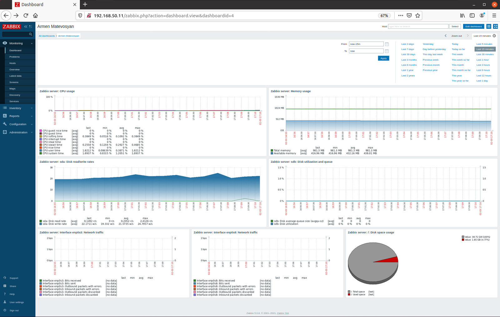
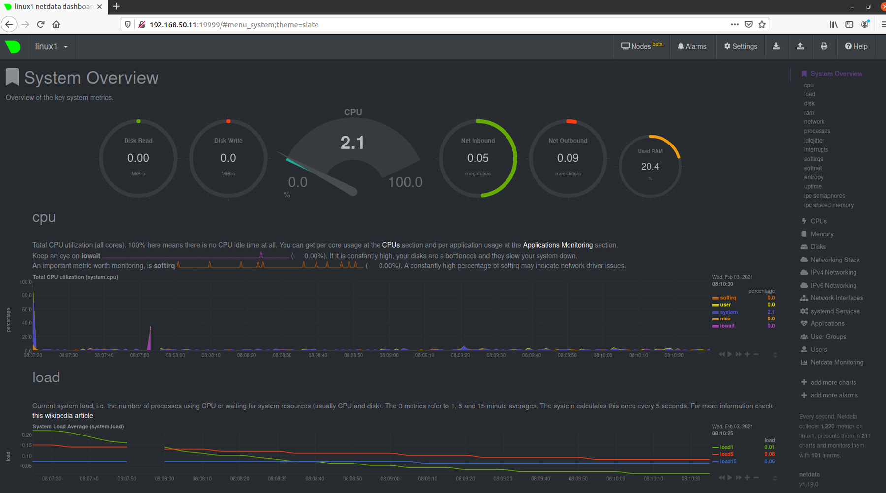

# Lesson 21 (Zabbix)


## Задача 

Настроить на одной из систем:
* zabbix (использовать screen (комплексный экран).
* prometheus - grafana.

Использование систем примеры которых не рассматривались на занятии. Cписок возможных систем был приведен в презентации.

## Решения

### Zabbix

Развернем Zabbix на **[Vagrant](vagrantfile)** с помощью скрипта устанвки и настройки - **[zabbix.sh](zabbix.sh)**.

После запуска vagrant наш frontend сервера zabbix будет доступен по адресу http://192.168.50.11.

Наш dashboard c требуемыми настройками:




### NetData

Установим Netdata на Ubuntu 20.04. По умолчанию Netdata доступен в репозитории Ubuntu.

```
sudo apt update
sudo apt install netdata -y
```

Настроим на нужный адрес:

```
sudo nano /etc/netdata/netdata.conf

[global]
        run as user = netdata
        web files owner = root
        web files group = root
        # Netdata is not designed to be exposed to potentially hostile
        # networks. See https://github.com/netdata/netdata/issues/164
        bind socket to IP = 192.168.50.11
```


Перезапустим сервис и убедимся что активен:

```
sudo systemctl restart netdata

sudo systemctl status netdata
```

Доступ к веб-интерфейсу Netdata -  http://192.168.50.11:19999

