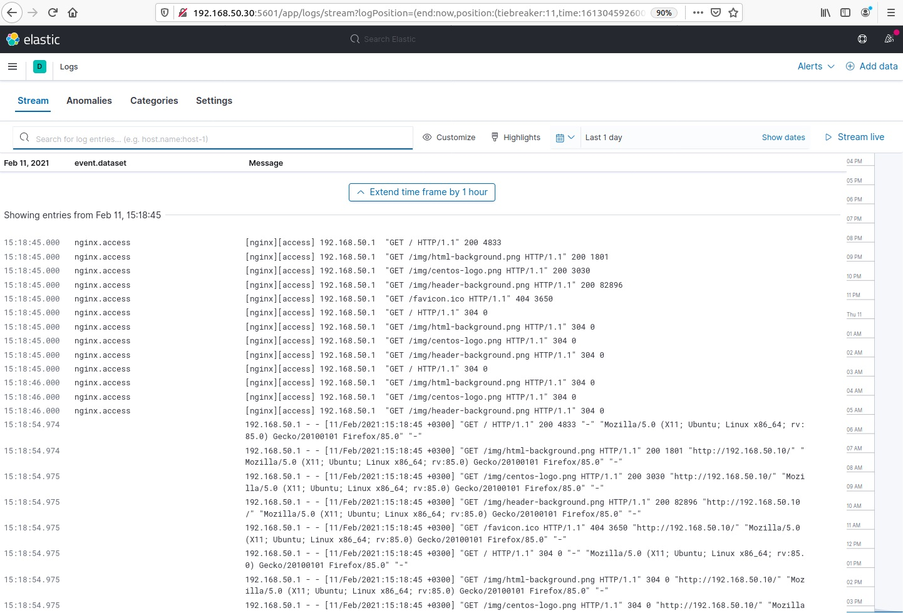

# Lesson 22 (Logs / ELK)

## Задача

Настраиваем центральный сервер для сбора логов. В вагранте поднимаем 2 машины web и log.
На web поднимаем nginx, на log настраиваем центральный лог сервер на любой системе на выбор:
- journald
- rsyslog
- elk

Настраиваем аудит следящий за изменением конфигов нжинкса

Все критичные логи с web должны собираться и локально и удаленно.
Все логи с nginx должны уходить на удаленный сервер (локально только критичные).
Логи аудита должны также уходить на удаленную систему.


* развернуть еще машину elk и таким образом настроить 2 центральных лог системы (elk и какую либо еще).

В elk должны уходить только логи нжинкса, во вторую систему все остальное.

## Решение

Решения двух задач (основного и со звездочкой) реализовано в автоматической сборке [Vagrant](Vagrantfile).

### Структура стенда и задачи


### Настроим сбор логов Nginx на серевер логов Log.

На всех серверах синхронизируем время через ntpd.

**Настройки сервера логов rsyslog server.**

Логи будут собираться в директории /var/log/rsyslog по структуре Hostname->ServiceName. Создаем папку:

```
mkdir /var/log/rsyslog
```
Конфигурируем файл /etc/rsyslog.conf (необходимые значения отличных от по-умолчанию):
```
# Provides TCP syslog reception
$ModLoad imtcp
$InputTCPServerRun 514
```
Разрешим передачу через TCP 514 порт. Это нужно меть ввиду при настройке файрвола, если это необходимо:

```
sudo firewall-cmd --permanent --add-port=514/tcp
sudo firewall-cmd --reload
```

В разделе Rules /etc/rsyslog.conf

```
#### RULES ####

$template RemoteLogs,"/var/log/rsyslog/%HOSTNAME%/%PROGRAMNAME%.log"
if $fromhost-ip == "192.168.50.10" then ?RemoteLogs
& stop
```

Перезапускаем сервер rsyslog:
```
sudo systemctl restart rsyslog
```
> Если возникают проблемы с SELinux, разрешаем трафик rsyslog:
```
sudo semanage -a -t syslogd_port_t -p udp 514
sudo semanage -a -t syslogd_port_t -p tcp 514
```


**Настройки клиента rsyslog.**


В конфигурационном файл Nginx внесем изменения для лог файлов (/etc/nginx/nginx.conf):

```
access_log syslog:server=192.168.50.20:514,tag=nginx_access main;
error_log syslog:server=192.168.50.20:514,tag=nginx_error notice;
error_log /var/log/nginx/error.log crit;
```

> Подробнее: https://nginx.org/ru/docs/syslog.html

Запустим Nginx

```
sudo systemctl enable nginx --now
```

В конце файла /etc/rsyslog.conf добавим:
```
*.* @@192.168.50.20:514
```
> Значение адреса сервера и порт с @@ - порт TCP, с @ - порт UDP.


### Настроим сбор логов auditd на серевер логов Log (аудит за изменением конфигов Nginx).

По умолчанию системный аудит отключен. Для его активации необходимо настроить запуск ядра с параметром audit=1. Если данный параметр присутствует, а демон auditd не запущен, то события журналируются в файл /var/log/messages.

Для мониторинга файлов конфигурации Nginx настроим auditd. 

Установка пакетов:
```
yum install audit audispd-plugins
```

Посмотрим правила и добавим правило:
```
auditctl -l

auditctl -w /etc/nginx/nginx.conf -p wa -k nginx_config_changed
```
где:

```
-w = путь к файлу за которомы следим

-p  = параметр типов операций доступа к файлу, которые следует отслеживать:
	r - операция чтения данных из файла
	w - операция записи данных в файл
	x - операция исполнения файла
	a - операция изменения атрибутов файла или директории

-k = ключ поиска событий, для поиска событий с ключом #ausearch -k my_key
```

Поиск событий аудита

```
ausearch -k web_config_changed
```

Удаление правила:
```
auditctl -W /etc/nginx/nginx.conf -p wa -k nginx_config_changed
```

Созданные правила таким путем удалятся после перезапуска системы. Чтобы сделать правило постоянным, нужно добавить его в файл /etc/audit/rules.d/audit.rules 
```
## First rule - delete all
-D

## Increase the buffers to survive stress events.
## Make this bigger for busy systems
-b 8192


## Set failure mode to syslog
-f 1


-w /etc/nginx/nginx.conf -p wa -k nginx_config_changed
-w /etc/nginx/conf.d/ -p wa -k nginx_config_changed

```

Поле настроек нужно перезапустить демон auditd:
```
systemctl restart auditd.service
```

Для отправки логов подсистемы аудита в централизованное хранилище используется плагин audisp-remote. Он входит в пакет audisp-plugins, который нужно устанавливать.

Конфигурационные файлы всех плагинов хранятся в директории /etc/audisp/plugins.d.

Настройки удалённого логгирования прописываются в конфигурационном файле /etc/audisp/plugins.d/audisp-remote.conf. Чтобы активировать отправку логов в удалённое хранилище, параметр active меняем на yes. 

```
active = yes
direction = out
path = /sbin/audisp-remote
type = always
#args =
format = string
```


Затем откроем файл etc/audisp/audisp-remote.conf и в качестве значения параметра remote_server укажем имя или IP-адрес cервера, на котором будут храниться логи.

```
remote_server = 192.168.50.20
port = 60
##local_port =
transport = tcp
queue_file = /var/spool/audit/remote.log
mode = immediate
queue_depth = 10240
format = managed
network_retry_time = 1
max_tries_per_record = 3
max_time_per_record = 5
heartbeat_timeout = 0 

network_failure_action = stop
disk_low_action = ignore
disk_full_action = warn_once
disk_error_action = warn_once
remote_ending_action = reconnect
generic_error_action = syslog
generic_warning_action = syslog
queue_error_action = stop
overflow_action = syslog

##enable_krb5 = no
##krb5_principal = 
##krb5_client_name = auditd
##krb5_key_file = /etc/audisp/audisp-remote.key
```

> **Если настроен (включен) firewalld, то для функционирования rsyslog и audispd необходимо открыть порты 514 и 60 по умолчанию.**

``` 
firewall-cmd --permanent --add-port=514/udp; sudo firewall-cmd --permanent --add-port=514/tcp
firewall-cmd --permanent --add-port=60/udp; sudo firewall-cmd --permanent --add-port=60/tcp
firewall-cmd --reload
```

**Проверим результат настроек**

На log настраиваем центральный лог сервер:

```
[root@log ~]# ll /var/log/rsyslog/web-server/
total 44
-rw-------. 1 root root 547 Feb  9 20:01 anacron.log
-rw-------. 1 root root 192 Feb  9 20:01 audisp-remote.log
-rw-------. 1 root root 149 Feb  9 20:01 CROND.log
-rw-------. 1 root root 646 Feb  9 19:11 nginx_access.log
-rw-------. 1 root root 229 Feb  9 19:11 nginx_error.log
-rw-------. 1 root root 288 Feb  9 20:01 run-parts(.log
-rw-------. 1 root root 336 Feb  9 19:10 sshd.log
-rw-------. 1 root root 193 Feb  9 19:10 sudo.log
-rw-------. 1 root root 144 Feb  9 19:10 su.log
-rw-------. 1 root root 723 Feb  9 20:01 systemd.log
-rw-------. 1 root root 122 Feb  9 19:10 systemd-logind.log

```

Настраиваем аудит следящий за изменением конфигов нжинкса

```
[root@log ~]# ausearch -ts today -i | grep nginx 

node=web type=CONFIG_CHANGE msg=audit(02/09/2021 19:14:17.188:1343) : auid=vagrant ses=4 op=updated_rules path=/etc/nginx/nginx.conf key=web_config_changed list=exit res=yes 
node=web type=PROCTITLE msg=audit(02/09/2021 19:14:17.188:1344) : proctitle=vi /etc/nginx/nginx.conf 
node=web type=PATH msg=audit(02/09/2021 19:14:17.188:1344) : item=3 name=/etc/nginx/nginx.conf~ inode=33712462 dev=08:01 mode=file,644 ouid=root ogid=root rdev=00:00 obj=system_u:object_r:httpd_config_t:s0 objtype=CREATE cap_fp=none cap_fi=none cap_fe=0 cap_fver=0 
node=web type=PATH msg=audit(02/09/2021 19:14:17.188:1344) : item=2 name=/etc/nginx/nginx.conf inode=33712462 dev=08:01 mode=file,644 ouid=root ogid=root rdev=00:00 obj=system_u:object_r:httpd_config_t:s0 objtype=DELETE cap_fp=none cap_fi=none cap_fe=0 cap_fver=0 
node=web type=PATH msg=audit(02/09/2021 19:14:17.188:1344) : item=1 name=/etc/nginx/ inode=33711096 dev=08:01 mode=dir,755 ouid=root ogid=root rdev=00:00 obj=system_u:object_r:httpd_config_t:s0 objtype=PARENT cap_fp=none cap_fi=none cap_fe=0 cap_fver=0 
node=web type=PATH msg=audit(02/09/2021 19:14:17.188:1344) : item=0 name=/etc/nginx/ inode=33711096 dev=08:01 mode=dir,755 ouid=root ogid=root rdev=00:00 obj=system_u:object_r:httpd_config_t:s0 objtype=PARENT cap_fp=none cap_fi=none cap_fe=0 cap_fver=0 
node=web type=CONFIG_CHANGE msg=audit(02/09/2021 19:14:17.188:1345) : auid=vagrant ses=4 op=updated_rules path=/etc/nginx/nginx.conf key=web_config_changed list=exit res=yes 
node=web type=PROCTITLE msg=audit(02/09/2021 19:14:17.188:1346) : proctitle=vi /etc/nginx/nginx.conf 
node=web type=PATH msg=audit(02/09/2021 19:14:17.188:1346) : item=1 name=/etc/nginx/nginx.conf inode=33683985 dev=08:01 mode=file,644 ouid=root ogid=root rdev=00:00 obj=unconfined_u:object_r:httpd_config_t:s0 objtype=CREATE cap_fp=none cap_fi=none cap_fe=0 cap_fver=0 
node=web type=PATH msg=audit(02/09/2021 19:14:17.188:1346) : item=0 name=/etc/nginx/ inode=33711096 dev=08:01 mode=dir,755 ouid=root ogid=root rdev=00:00 obj=system_u:object_r:httpd_config_t:s0 objtype=PARENT cap_fp=none cap_fi=none cap_fe=0 cap_fver=0 
node=web type=PROCTITLE msg=audit(02/09/2021 19:14:17.193:1347) : proctitle=vi /etc/nginx/nginx.conf 
node=web type=PATH msg=audit(02/09/2021 19:14:17.193:1347) : item=0 name=/etc/nginx/nginx.conf inode=33683985 dev=08:01 mode=file,644 ouid=root ogid=root rdev=00:00 obj=unconfined_u:object_r:httpd_config_t:s0 objtype=NORMAL cap_fp=none cap_fi=none cap_fe=0 cap_fver=0 
node=web type=PROCTITLE msg=audit(02/09/2021 19:14:17.193:1348) : proctitle=vi /etc/nginx/nginx.conf 
node=web type=PATH msg=audit(02/09/2021 19:14:17.193:1348) : item=0 name=/etc/nginx/nginx.conf inode=33683985 dev=08:01 mode=file,644 ouid=root ogid=root rdev=00:00 obj=system_u:object_r:httpd_config_t:s0 objtype=NORMAL cap_fp=none cap_fi=none cap_fe=0 cap_fver=0 
node=web type=PROCTITLE msg=audit(02/09/2021 19:14:17.193:1349) : proctitle=vi /etc/nginx/nginx.conf 
node=web type=PATH msg=audit(02/09/2021 19:14:17.193:1349) : item=0 name=/etc/nginx/nginx.conf inode=33683985 dev=08:01 mode=file,644 ouid=root ogid=root rdev=00:00 obj=system_u:object_r:httpd_config_t:s0 objtype=NORMAL cap_fp=none cap_fi=none cap_fe=0 cap_fver=0 

```

## ELK Stack для Nginx


ELK — это аббревиатура из названий трех продуктов: Elasticsearch, Logstash и Kibana. 

* Logstash — это инструмент получения, преобразования и сохранения данных в общем хранилище в виде: файла, базы данных, логов или информационных каналов.

* Elasticsearch — это собственно механизм индексирования и хранения полученной информации, а также полнотекстового поиска по ней, по сути, является NoSQL database решением. 

* Kibana — это интерфейс для Elasticsearch.


Механизм взаимодествия компонентов ELK:


### Установка ELK

Подключаем родной репозиторий и устанавливаем пакеты:

```
rpm --import https://artifacts.elastic.co/GPG-KEY-elasticsearch

cat >> /etc/yum.repos.d/elasticsearch.repo << EOF
[elasticsearch-7.x]
name=Elasticsearch repository for 7.x packages
baseurl=https://artifacts.elastic.co/packages/7.x/yum
gpgcheck=1
gpgkey=https://artifacts.elastic.co/GPG-KEY-elasticsearch
enabled=1
autorefresh=1
EOF
```

```
yum install elasticsearch kibana logstash
```

### Настройки ELK

Настройки Elasticsearch:
```
vi /etc/elasticsearch/elasticsearch.yml

http.port: 9200
network.host: 192.168.50.30
```

Запустим и проверим:
```
systemctl enable elasticsearch.service --now
```

```
curl -v http://localhost:9200


* About to connect() to localhost port 9200 (#0)
*   Trying ::1...
* Connected to localhost (::1) port 9200 (#0)
> GET / HTTP/1.1
> User-Agent: curl/7.29.0
> Host: localhost:9200
> Accept: */*
> 
< HTTP/1.1 200 OK
< content-type: application/json; charset=UTF-8
< content-length: 519
< 
{
  "name" : "elk",
  "cluster_name" : "elk",
  "cluster_uuid" : "dV2SYgpxR5K273bqPhtKyA",
  "version" : {
    "number" : "7.11.0",
    "build_flavor" : "default",
    "build_type" : "rpm",
    "build_hash" : "8ced7813d6f16d2ef30792e2fcde3e755795ee04",
    "build_date" : "2021-02-08T22:44:01.320463Z",
    "build_snapshot" : false,
    "lucene_version" : "8.7.0",
    "minimum_wire_compatibility_version" : "6.8.0",
    "minimum_index_compatibility_version" : "6.0.0-beta1"
  },
  "tagline" : "You Know, for Search"
}
* Connection #0 to host localhost left intact
```

Запустим Kibana и проверим:

```
systemctl enable kibana.service --now
```

```
curl -v http://localhost:5601

* About to connect() to localhost port 5601 (#0)
*   Trying ::1...
* Connection refused
*   Trying 127.0.0.1...
* Connected to localhost (127.0.0.1) port 5601 (#0)
> GET / HTTP/1.1
> User-Agent: curl/7.29.0
> Host: localhost:5601
> Accept: */*
> 
< HTTP/1.1 302 Found
< location: /spaces/enter
< kbn-name: elk
< kbn-license-sig: 08cb929a328430ae355b3a2cbd83ae4c505f5720ddd77feaa0512ebb06f91681
< cache-control: private, no-cache, no-store, must-revalidate
< content-length: 0
< Date: Thu, 11 Feb 2021 10:33:18 GMT
< Connection: keep-alive
< Keep-Alive: timeout=120
< 
* Connection #0 to host localhost left intact
```

Настройки Logstash

Создаем правила для input, output и filter. Файл настроек выглядит так:

```
cat /etc/logstash/conf.d/logstash-nginx.conf 

input {
    beats {
        port => 5400
        ssl => false
    }
}

filter {
 grok {
   match => [ "message" , "%{COMBINEDAPACHELOG}+%{GREEDYDATA:extra_fields}"]
   overwrite => [ "message" ]
 }
 mutate {
   convert => ["response", "integer"]
   convert => ["bytes", "integer"]
   convert => ["responsetime", "float"]
 }
 geoip {
   source => "clientip"
   add_tag => [ "nginx-geoip" ]
 }
 date {
   match => [ "timestamp" , "dd/MMM/YYYY:HH:mm:ss Z" ]
   remove_field => [ "timestamp" ]
 }
 useragent {
   source => "agent"
 }
}

output {
 elasticsearch {
   hosts => ["localhost:9200"]
   index => "weblogs-%{+YYYY.MM.dd}"
   document_type => "nginx_logs"
 }
 stdout { codec => rubydebug }
}
```

Слушает на порту 5400, ssl отключен. Полученную информацию фильтрует через grok и отдает elasticsearch на порт 9200.

Запустим и проверим работу:

```
systemctl restart logstash.service

ss -tulpn | grep 5400
```

> ELK штука неспешная, поэтому порт может появится не сразу.


### Настройка клиента для ELK

На нашем сервере web установим необходимые пакеты - Filebeat:

```
rpm --import https://artifacts.elastic.co/GPG-KEY-elasticsearch

cat >> /etc/yum.repos.d/elasticsearch.repo << EOF
[elasticsearch-7.x]
name=Elasticsearch repository for 7.x packages
baseurl=https://artifacts.elastic.co/packages/7.x/yum
gpgcheck=1
gpgkey=https://artifacts.elastic.co/GPG-KEY-elasticsearch
enabled=1
autorefresh=1
EOF

yum install -y filebeat
```

Настройки для filebeat:

```
....
filebeat.inputs:

- type: log
  enabled: true

  paths:
    - /var/log/nginx/*.log
  exclude_files: ['.gz$']
....

....
output.logstash:
  hosts: ["192.168.50.30:5400"]
....

```

```
systemctl enable filebeat --now
```

> Обязательно нужно проверить статус filebeat: ``` systemctl status filebeat ```. Если возникают ошибки при запуске, можно попробовать:

```
tail -f /var/log/filebeat/filebeat

/usr/share/filebeat/bin/filebeat -c /etc/filebeat/filebeat.yml -e -v
```

### Мониторим Nginx в ELK

Подключим логи Nginx к Kibana:


### Подключаем стандартный модуль Nginx Filebeat

Настройки для filebeat:

```
....
filebeat.inputs:

- type: log
  enabled: true

  paths:
    - /var/log/nginx/*.log
  exclude_files: ['.gz$']
....

....
setup.kibana:
  host: "192.168.50.30:5601"

output.elasticsearch:
  hosts: ["192.168.50.30:9200"]
....

```

```
filebeat modules enable nginx
```


```
filebeat setup

systemctl restart filebeat
```


