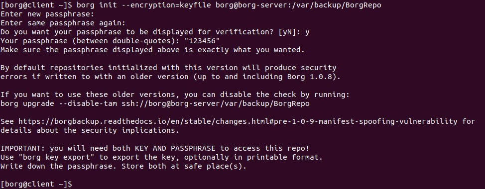

# Lesson 23 (Borg Backup)

## Задача

Настроить стенд Vagrant с двумя виртуальными машинами: backup_server и client

Настроить удаленный бекап каталога /etc c сервера client при помощи borgbackup. Резервные копии должны соответствовать следующим критериям:

- Директория для резервных копий /var/backup. Это должна быть отдельная точка монтирования. В данном случае для демонстрации размер не принципиален, достаточно будет и 2GB.
- Репозиторий дле резервных копий должен быть зашифрован ключом или паролем - на ваше усмотрение
- Имя бекапа должно содержать информацию о времени снятия бекапа
- Глубина бекапа должна быть год, хранить можно по последней копии на конец месяца, кроме последних трех. Последние три месяца должны содержать копии на каждый день. Т.е. должна быть правильно настроена политика удаления старых бэкапов
- Резервная копия снимается каждые 5 минут. Такой частый запуск в целях демонстрации.
- Написан скрипт для снятия резервных копий. Скрипт запускается из соответствующей Cron джобы, либо systemd timer-а.

## Решение

BorgBackup (сокращенно: Borg) - это дедуплицирующая программа резервного копирования (РК). Опционально он поддерживает сжатие и аутентифицированное шифрование.

Borg обеспечивает эффективный и безопасный способ резервного копирования данных. Используемый метод дедупликации данных делает Borg подходящим для ежедневного резервного копирования, поскольку сохраняются только изменения.

В Borg нет понятия дифференциальной и инкрементальной резервной копии, резервная копия всегда полная, однако благодаря методу дедупликации в РК попападают только изменения. Это обеспечивает схожесть технологий дифференциальной и инкрементальной резервых копий.

Borg поддерживает разные аллгоритмы сжатия, по умолчанию алгоритм сжатия - lz4, если необходим другой метод сжатия, нужно указать в опции --compression:

* borg create --compression lz4 
* borg create --compression zstd 
* borg create --compression zlib
* borg create --compression auto
* borg create --compression none

```
auto - проверяет с lz4, можно ли сжимать данные.
none - сжатие не используется.
```

Borg Backup поддерживает шифрование резервных копий. Для шифрования используется опция --encryption (-e). Медоты  шифрования:

* none - не использовать шифрование;
* repokey - парольная фраза, использует метод шифрования представляет собой ключевой хэш, алгоритм HMAC-SHA256, сохраняет зашифрованный ключ в ```<REPO_DIR>/ config```
* keyfile - создает ключ шифрования, алгоритм HMAC-SHA256, хранит зашифрованный ключ в ```~/.config/borg/keys/```
* repokey-blake2 - являются аутентифицируемым режимамом шифрования, использует BLAKE2b-256 вместо HMAC-SHA256 для аутентификации. Хэш идентификатора блока представляет собой ключевой хэш BLAKE2b-256, сохраняет зашифрованный ключ в ```<REPO_DIR>/ config```


### Настройка стенда

Подготовленный [Vagrantfile](vagrantfile) собирает стед из двух машин: server и client. На server монтирован второй диск размером в 2Гб с точкой монтирования /var/backup. Установлены необходимые пакеты для BorgServer. BorgServer управляется пользователем borg.

Между пользователями borg@client и borg@server должно быть настроено соедиенние по ssh.

### Нстройки клиента

Логинимся под пользвателем:
```
su -l borg
```

Создаем подключение по ssh ключам между клиентом и сервером. Подключение с клиента на сервер. 
На клиенте:
```
$ ssh-keygen
$ cat ~/.ssh/id_rsa.pub | ssh borg@borg-server "mkdir -p ~/.ssh && cat >> .ssh/authorized_keys"
```

При первом соединении требуется согласние на подключение (вносится запись в файл known_hosts).

Разрешения на файлы и директории для ```~/.ssh```:

```
chmod 700 ~/.ssh; chmod 600 ~/.ssh/*
```

Или более быстро:

```
ssh-keygen -q -t rsa -N '' -f ~/.ssh/id_rsa <<<y 2>&1 >/dev/null && chmod 700 ~/.ssh; chmod 600 ~/.ssh/*
cat ~/.ssh/id_rsa.pub | ssh borg@borg-server "mkdir -p ~/.ssh && cat >> .ssh/authorized_keys"
```

### Настройки сервера

На сервере выполним:

```
su -l borg
chmod 700 ~/.ssh; chmod 600 ~/.ssh/*
```

На сервере смонтирован отдельный диск для РК по адресу /var/backup (создается и монтируется vagrant):

```
df -h
ll -la /var/backup
```


### Настройки и запуск резервных копий

Проверим наше соединение с клиента на сервер по ssh:

```
ssh borg@borg-server
```

Инициализируем с клиента репозитории **BorgRepo** (шифрование через ssh ключ - keyfile). Ключ шифрования находится в ```~/.config/borg/keys/```:

Создаем репозиторий. Вводим парольную фразу и соглашаемся. Будет создан ключ шифрования.

```
$ borg init --encryption=keyfile borg@borg-server:/var/backup/BorgRepo
```



**Примеры команд:**
```
Создаем РК папки /home в наш репозиторий на сервере

$ borg create --stats --list borg@borg-server:/var/backup/BorgRepo::"home-{now:%Y-%m-%d_%H:%M:%S}" /home

Получение информации по архивам:

$ borg info borg@borg-server:/var/backup/BorgRepo

$ borg list borg@borg-server:/var/backup/BorgRepo::home-2021-02-15_11:23:12

Восстановление архива

$ borg extract borg@borg-server:/var/backup/BorgRepo::home-2021-02-15_11:23:12 

Восстановление файла из архива

$ borg extract borg@borg-server:/var/backup/BorgRepo::home-2021-02-15_11:23:12 /home/filename

Удаление репозитория 

borg delete borg@borg-server:/var/backup/BorgRepo

Удаление конкретного архива

borg delete borg@borg-server:/var/backup/BorgRepo::home-2021-02-15_11:23:12
```

**Скрипт для создания РК в наш репозиторий:**

```
#!/usr/bin/env bash

# Переменные
USER=borg
SERVER=borg-server
REPO=/var/backup/BorgRepo
BACKDIR=/etc
REPOSITORY=$USER@$SERVER:$REPO

# парольная фраза для шифрования
export BORG_PASSPHRASE="123456" 

# команда на создание РК
borg create --stats --list $REPOSITORY::"{hostname}-{now:%Y-%m-%d_%H:%M:%S}" $BACKDIR

# журнал процесса направить в journalctl
2>&1

# если возникла ошибка, сбросить значение BORG_PASSPHRASE и выйти
if [ "$?" = "1" ] ; then
   export BORG_PASSPHRASE=""
   exit 1
fi

# Условия очистки репозитория от РК (все архивы за 3 месяца и последний на конец месяца до 12 месяцев)
borg prune -v --show-rc --list $REPOSITORY \
    --keep-within=3m \
    --keep-monthly=12

# Вывод существующих РК в репозитории
borg list $REPOSITORY

# Сброс BORG_PASSPHRASE
export BORG_PASSPHRASE=""

exit 0
```

### Запуск по расписанию

Для запуска резервного копирования можно поместить наш скрипт в cron с требуемой частатой выполнения:

```
crontab -e

*/5 * * * * /home/borg/borg-backup.sh
```

Другой вариант запуска по расписанию - через юниты systemd.

**Создаем юниты systemd**


Таймер systemd (borg-backup.timer)

```
[Unit]
Description=Borg Client Backup Timer
 
[Timer]
# Run every 300 second (5 min)
OnUnitActiveSec=300
Unit=borg-backup.service
 
[Install]
WantedBy=multi-user.target
```

Определяем интервал запуска юнита borg-backup.service. 


Сервис systemd (borg-backup.service)

```
[Unit]
Description=Borg Client Backup
 
[Service]
Type=oneshot
Nice=19
ExecStartPre=/usr/bin/borg break-lock borg@borg-server:/var/backup/BorgRepo
ExecStart=/home/borg/borg-backup.sh
User=borg
Group=borg
```
Тут определям nice=19, т.е самый нижний приоритет, чтоб процесс РК не занимал важные рессурсы.
В ExecStartPre делаем разблокировку репозитория. Такая ситуация может возникнуть, когда скажем при попытке начать РК произошла перезагрузка системы или был прерван процесс РК. Репозитроий borg останется блокированным. Чтоб снять блокировку, запускаем с опцией ``` break-lock  ```. Если делать РК репозитория с удерживаемой блокировкой, то блокировка будет присутствовать в копии.

Юнит запускается под пользователем borg.

Запуск юнитов systemd:
```
sudo systemctl daemon-reload
sudo systemctl enable borg-backup.service --now  
sudo systemctl enable borg-backup.timer --now 
```
Проверим результат:

