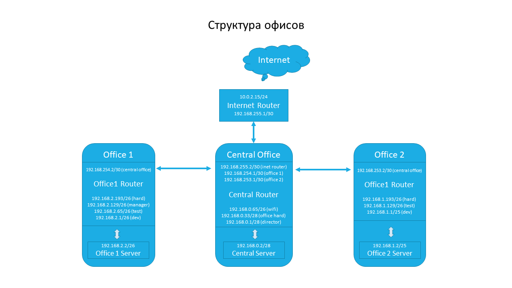
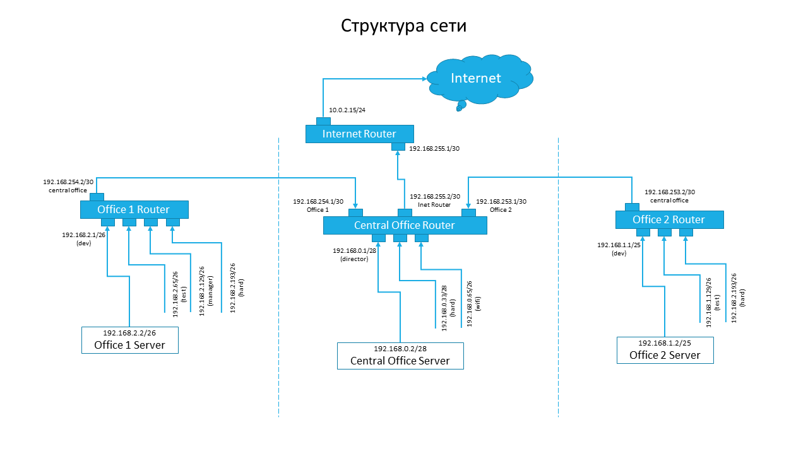
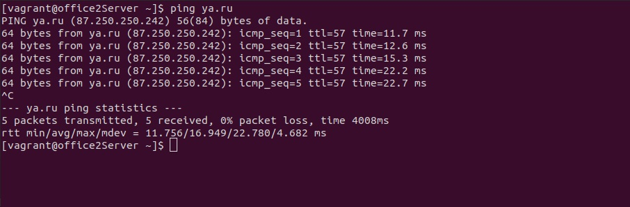
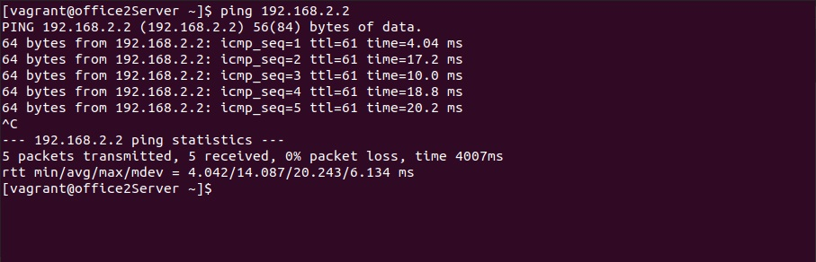
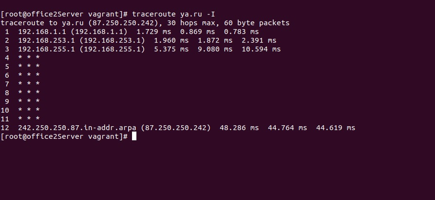
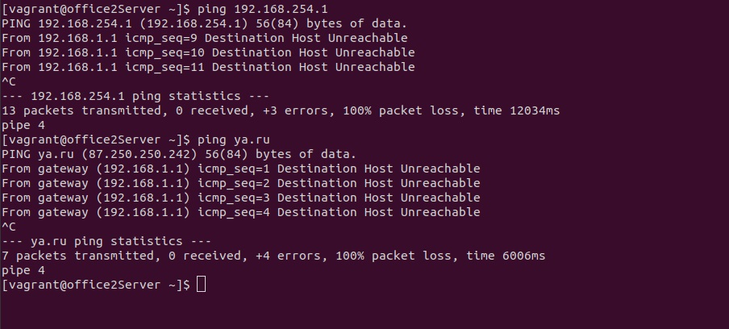

# Lesson 25 (Networks)

## Задача

```
Разворачиваем сетевую лабораторию

# otus-linux
Vagrantfile - для стенда урока 9 - Network

# Дано
https://github.com/erlong15/otus-linux/tree/network
(ветка network)

Vagrantfile с начальным построением сети
- inetRouter
- centralRouter
- centralServer

тестировалось на virtualbox

# Планируемая архитектура
построить следующую архитектуру

Сеть office1
- 192.168.2.0/26 - dev
- 192.168.2.64/26 - test servers
- 192.168.2.128/26 - managers
- 192.168.2.192/26 - office hardware

Сеть office2
- 192.168.1.0/25 - dev
- 192.168.1.128/26 - test servers
- 192.168.1.192/26 - office hardware


Сеть central
- 192.168.0.0/28 - directors
- 192.168.0.32/28 - office hardware
- 192.168.0.64/26 - wifi


Office1 ---\
-----> Central --IRouter --> internet
Office2----/

Итого должны получится следующие сервера
- inetRouter
- centralRouter
- office1Router
- office2Router
- centralServer
- office1Server
- office2Server

# Теоретическая часть
- Найти свободные подсети
- Посчитать сколько узлов в каждой подсети, включая свободные
- Указать broadcast адрес для каждой подсети
- проверить нет ли ошибок при разбиении

# Практическая часть
- Соединить офисы в сеть согласно схеме и настроить роутинг
- Все сервера и роутеры должны ходить в инет черз inetRouter
- Все сервера должны видеть друг друга
- у всех новых серверов отключить дефолт на нат (eth0), который вагрант поднимает для связи
- при нехватке сетевых интервейсов добавить по несколько адресов на интерфейс
```

## Решение

Схема стенда:



Разеберем сществующие подсети:

**Central Office**
```
- directors 
Network:   192.168.0.0/28
Broadcast: 192.168.0.15
Hosts: 14       

- office hardware
Network:   192.168.0.32/28
Broadcast: 192.168.0.47
Hosts: 14 

- wifi
Network:   192.168.0.64/26
Broadcast: 192.168.0.127
Hosts: 62
```

**Office 1**
```
- dev 
Network:   192.168.2.0/26
Broadcast: 192.168.2.63
Hosts: 62

- test servers 
Network:   192.168.2.64/26
Broadcast: 192.168.2.127
Hosts: 62

- managers
Network:   192.168.2.128/26
Broadcast: 192.168.2.191
Hosts: 62

- office hardware
Network:   192.168.2.192/26
Broadcast: 192.168.2.255
Hosts: 62
```

**Office 2**
```
- dev 
Network:   192.168.1.0/25
Broadcast: 192.168.1.127
Hosts: 126

- test servers
Network:   192.168.1.128/26
Broadcast: 192.168.1.191
Hosts: 62

- office hardware 
Network:   192.168.1.192/26
Broadcast: 192.168.1.255
Hosts: 62
```

**Свободные подсети**

Свободные подстети есть в сетке 192.168.0.0/24

```
- 192.168.0.16/28
Broadcast: 192.168.0.31
Hosts: 14

- 192.168.0.48/28
Broadcast: 192.168.0.63
Hosts: 14

- 192.168.0.128/25
Broadcast: 192.168.0.255
Hosts: 126
```

## Реализация


Для полного понимания сетевого взаимодействия и выполнения практического задания изобразим инфраструктуру: 



Вся сетевая архитектура собрана в [Vagrantfile](vagrantfile).

Для отключения дефолт на NAT (eth0), который vagrant поднимает для связи, кроме роутера, который обеспечивает доступ в Интернет (**inetRouter**):

```
/etc/sysconfig/network-scripts/ifcfg-eth0

DEFROUTE=no
```

На всех роутерах необходимо включить пересылку пакетов (IP Forwarding):
```
/etc/sysctl.conf

net.ipv4.conf.all.forwarding=1
```

применить правило:
```
sysctl -p
``` 

Требующего особого внимания из узлов сети, можно выделить **inetRouter** и **centralRouter**.

#### inetRouter

Правила iptable для маскарадинга (NAT):
```
- Удалить все правила

iptables -F

- маскарадинг

iptables -t nat -A POSTROUTING ! -d 192.168.0.0/16 -o eth0 -j MASQUERADE

- сохранить правила
service iptables save
```

или через firewalld

```
firewall-cmd --permanent --add-masquerade
firewall-cmd --reload
```


Правила для роутинга

```
/etc/sysconfig/network-scripts/route-eth1

192.168.0.0/16 via 192.168.255.2 dev eth1
```

#### centralRouter

Сетевые адреса на интерфейс eth1 - 192.168.255.2 (на inetRouter 192.168.255.1)

```
ip addr add 192.168.253.1/30 dev eth1
ip addr add 192.168.254.1/30 dev eth1
```
или 

```
nmcli connection modify "System eth1" +ipv4.addresses "192.168.254.1/30"
nmcli connection modify "System eth1" +ipv4.addresses "192.168.253.1/30"
```

Для настройки сетевых соединений используем nmcli.

nmcli (network manager command-line interface) — утилита для настройки сети, которая позволяет использовать Network Manager в консоли.

Примеры команд nmcli:

```
Посмотреть соединения (может принимать сокращенные значения опций)

$ nmcli connection show
или
$ nmcli con show
или
$ nmcli c s

Посмотреть информацию об интерфейсах

$ nmcli dev show

Посмотреть информацию о конкретном интерфейсе (ens192)

$ nmcli dev show ens192

Посмотреть статус интерфейсов (активные/неактивные)

$ nmcli dev status

Изменить имя интерфейса «Wired connection 1» на «ens224» (DEVICE=ens224)

$ sudo nmcli con mod "Wired connection 1" connection.interface-name "ens224"

Добавить интерфейс

$ sudo nmcli con add con-name "static-ens224" ifname ens224 type ethernet ip4 192.168.1.76/24 gw4 192.168.1.1


Добавить статический роутинг

$ sudo nmcli con mod "System ens192" +ipv4.routes "10.0.0.0/8 10.33.22.11"
```


Правила для роутинга

```
/etc/sysconfig/network-scripts/route-eth1

192.168.1.0/24 via 192.168.253.2 dev eth1
192.168.2.0/24 via 192.168.254.2 dev eth1
```

Или через nmcli:

```
nmcli con mod "System eth1" +ipv4.routes "192.168.1.0/24 192.168.253.2"
nmcli con mod "System eth1" +ipv4.routes "192.168.2.0/24 192.168.254.2"
```


### Проверка соединений сети:

Отправит запросы icmp на сервер ya.ru c office2Server



Отправит запросы icmp на сервер office1Server c office2Server



Проверим через какие хосты идут пакеты с office2Server на ya.ru



Отключим centralRouter и проверим возможность связи с office1Server на office2Server и ya.ru



Сеть функционирует согласно поставленным требованиям.