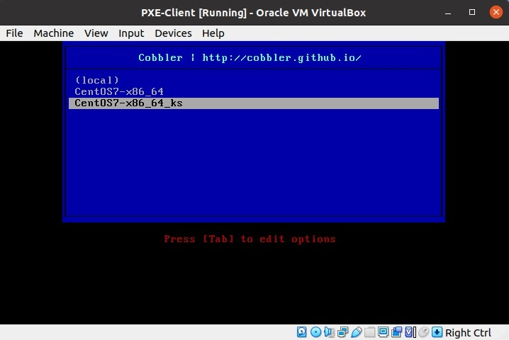
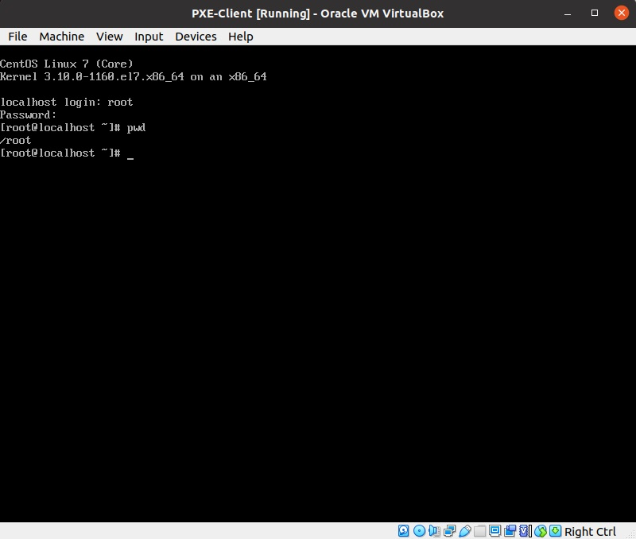

# Lesson 26 (Cobbler)


## Задание:
```
Следуя шагам из документа установить и настроить Cobbler - https://cobbler.github.io/quickstart/
 - автоматизировать процесс установки

Результат работы:
 - ссылка на репозиторий github
 - Vagrantfile с шагами установки необходимых компонентов
```

## Решение

Подготовим [vagrantfile](vagrantfile) с настройками сервера. Веб интерфейс будет доступен с хоста по адресу - https://localhost:8081/cobbler_web

> Для автоматического развертывания и настроек Cobbler необходимо установить дополнительный плагин для Vagrant - [vagrant-reload](https://github.com/aidanns/vagrant-reload).

```
vagrant plugin install vagrant-reload
```

**Образ CentOS 7 должен находится в папке с файлом vagrantfile!**

### Установка 

Установим необходимые пакеты для Cobbler:

```
yum install cobbler cobbler-web httpd yum-utils pykickstart xinetd debmirror dhcp bind fence-agents tftp-server tftp
```

### Настройки 

Настройки Cobbler

Генерируем пароль для root

```
openssl passwd -1 Pa$$w0rd

$1$jrdTcMwW$yYJ8tWyQQT1JymsQ0Zs8v1
```

```
vim /etc/cobbler/settings

default_password_crypted: "$1$jrdTcMwW$yYJ8tWyQQT1JymsQ0Zs8v1"
manage_dhcp: 1
manage_dns: 0
pxe_just_once: 1
next_server: 192.168.1.5
server: 192.168.1.5
```

Настройки DHCP

```
vim /etc/cobbler/dhcp.template


subnet 192.168.1.0 netmask 255.255.255.0 {
     option routers             192.168.1.5;
     option domain-name-servers 8.8.8.8;
     option subnet-mask         255.255.255.0;
     range dynamic-bootp        192.168.1.100 192.168.1.150;
     default-lease-time         21600;
     max-lease-time             43200;
     next-server                $next_server;

```

```
vim  /etc/cobbler/dnsmasq.template 

dhcp-range=192.168.1.100,192.168.1.150
dhcp-option=66,$next_server
dhcp-lease-max=1000
dhcp-authoritative
dhcp-boot=pxelinux.0
dhcp-boot=net:normalarch,pxelinux.0
dhcp-boot=net:ia64,$elilo

```

### Подготовка к запуску

Проверка конфигурации:
```
cobbler check
```

Выполняем рекомендации:

```
vim /etc/selinux/config

SELINUX=disabled
```
```
cobbler get-loaders
```

И приходим к результату:

```
# cobbler check

No configuration problems found.  All systems go.
```

Перезапустим Cobbler

```
systemctl restart cobblerd
```

И делаем первую синхронизацию

```
cobbler sync
```

Монтируем образ системы: 

```
mount -t iso9660 -o loop,ro /vagrant/CentOS-7-x86_64-DVD-2009.iso /mnt
```

Импортируем систему CentOS в Cobbler:
```
cobbler import --arch=x86_64 --path=/mnt --name=CentOS7
```

Просмотр 

```
cobbler distro list
```

Информацию о сборке можно посмотреть командой

```
cobbler distro report --name=CentOS7-x86_64
```

### Система для загрузки по сети

После создания профиля и дистрибутива, создаем систему:
```
cobbler system add --name=CentOS --profile=centos7-x86_64
```

Проверим

```
cobbler system list

cobbler system report --name=CentOS
```

Те же самые действия можно сделать через веб интерфейс.
```
https://localhost:8081/cobbler_web

login/pass = cobbler/cobbler
```


Подготовим kickstart файл

```
vi /var/lib/cobbler/kickstarts/centos7.ks


# This kickstart file should only be used with RHEL 4, 5 and Fedora < 8.
# For newer distributions please use the sample_end.ks

#platform=x86, AMD64, or Intel EM64T
# System authorization information
auth  --useshadow  --enablemd5
# System bootloader configuration
bootloader --location=mbr
# Partition clearing information
clearpart --all --initlabel
# Use text mode install
text
# Firewall configuration
firewall --enabled
# Run the Setup Agent on first boot
firstboot --disable
# System keyboard
keyboard us
# System language
lang en_US
# Use network installation
url --url=$tree
# If any cobbler repo definitions were referenced in the kickstart profile, include them here.
$yum_repo_stanza
# Network information
$SNIPPET('network_config')
# Reboot after installation
reboot

#Root password
rootpw --plaintext Pa$$w0rd
# SELinux configuration
selinux --disabled
# Do not configure the X Window System
skipx
# System timezone
timezone  America/New_York
# Install OS instead of upgrade
install
# Clear the Master Boot Record
zerombr
# Allow anaconda to partition the system as needed
autopart
```

Применим к нашей системе:

```
cobbler profile list

CentOS7-x86_64
```

```
cobbler profile add --name=CentOS7-x86_64_ks --distro=CentOS7-x86_64 --kickstart=/var/lib/cobbler/kickstarts/centos7.ks
```

```
cobbler profile list
   CentOS7-x86_64
   CentOS7-x86_64_ks
```

### Запуск клиента

Создаем виртуальную машину Клиента (аналогично как для PXE) и запускаем:



При выборе профайла CentOS7-x86_64_ks установка произойдет в автоматическом режиме. После перезагрузки можно логиниться с назначенным паролем.


