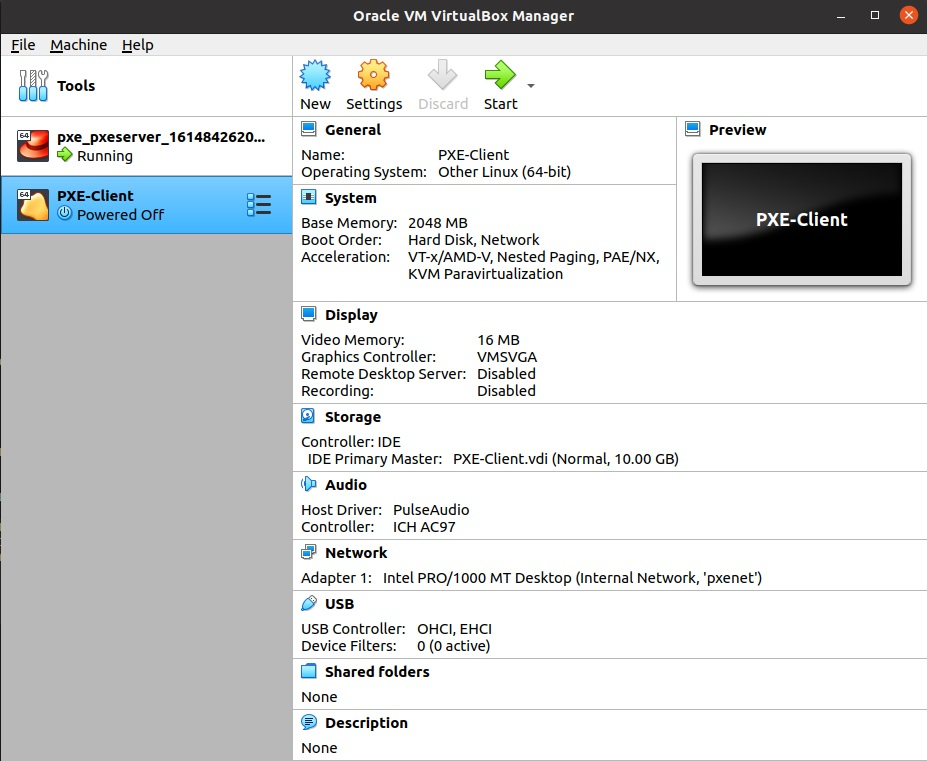
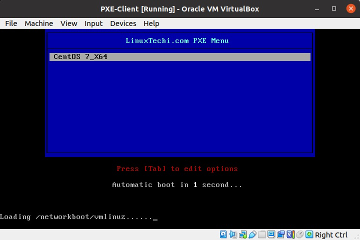
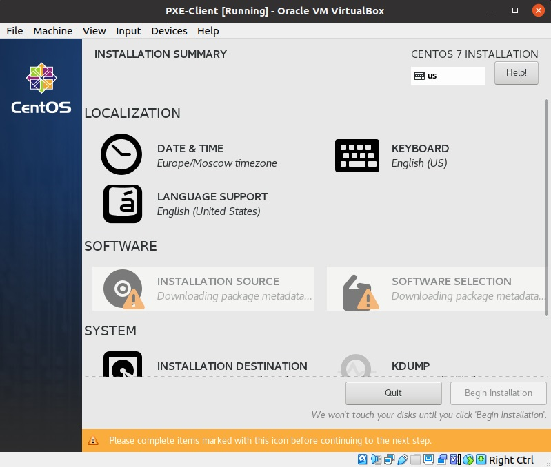
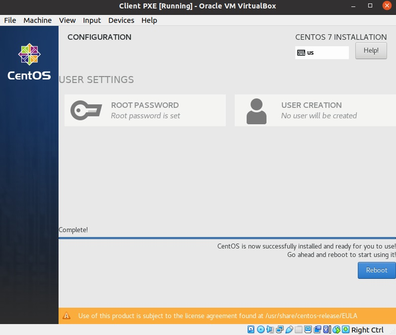
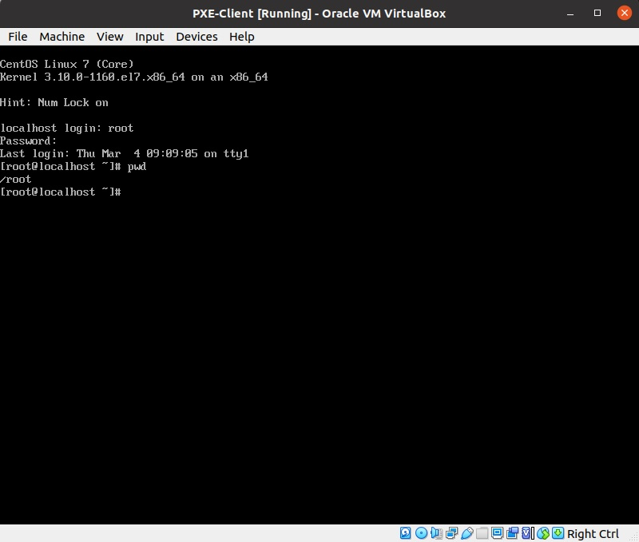

# Lesson 26 (PXE Server)

## Задание

```
Следуя шагам из документа установить и настроить загрузку по сети для дистрибутива CentOS8
https://docs.centos.org/en-US/8-docs/advanced-install/assembly_preparing-for-a-network-install либо репозиторием https://github.com/nixuser/virtlab/tree/main/centos_pxe
настроить установку из репозитория HTTP
настроить автоматическую установку для созданного kickstart файла (*)

Результат работы:
ссылка на репозиторий github. 
Vagrantfile с шагами установки необходимых компонентов
исходный код scripts для настройки сервера (если необходимо)
если какие-то шаги невозможно или сложно автоматизировать, то  инструкции по ручным шагам для настройки
```


## Решение

Для решения данной задачи будут развернуты:
* TFTP Server
* DHCP Server
* Syslinux
* FTP Server (vsftpd)
* Xinetd

Для автоматизации решения необходимо в папке с [vagrantfile](vagrantfile) разместить iso образ дистрибутива Linux CentOS. Для уменьшения размера данных в примере будет использован последний на сегодня [дистрибутив CentOS 7](https://mirror.yandex.ru/centos/7.9.2009/isos/x86_64/CentOS-7-x86_64-DVD-2009.iso) (4Гб против 9Гб).

### Исходные данные 

Server IP = 192.168.50.10
Host name = pxe.airmeno.ru
OS = CentOS 7
SELinux = enabled
Firewall = disable (но необходимые настройки будут представлены)


### Установка и настройка 

Установим необходимые пакеты:
```
yum install dhcp tftp tftp-server syslinux vsftpd xinetd
```

Подготовим файлы настроек серверов:

**DHCP**

```
vi /etc/dhcp/dhcpd.conf

# DHCP Server Configuration file.

ddns-update-style interim;
ignore client-updates;
authoritative;
allow booting;
allow bootp;
allow unknown-clients;

# internal subnet for my DHCP Server
subnet 192.168.50.0 netmask 255.255.255.0 {
range 192.168.50.51 192.168.50.100;
option domain-name-servers 8.8.8.8;
option domain-name "pxe.airmeno.ru";
option routers 192.168.50.1;
option broadcast-address 192.168.50.255;
default-lease-time 600;
max-lease-time 7200;

# IP of PXE Server
next-server 192.168.50.10;
filename "pxelinux.0";
}
```

В настройках DHCP указаны параметы сети, диапазона адресов, выдаваемых DHCP, опции: сервер DNS, шлюз, время аренды, адрес PXE сервера.

**TFTP**

```
vi /etc/xinetd.d/tftp

service tftp
{
 socket_type = dgram
 protocol    = udp
 wait        = yes
 user        = root
 server      = /usr/sbin/in.tftpd
 server_args = -s /var/lib/tftpboot
 disable     = no
 per_source  = 11
 cps         = 100 2
 flags       = IPv4
}
```
Значения по умолчанию, кроме того что указали, что сервер активен (disable = no).

**Создаем необходимые папки и копируем файлы**

Необходимо расположить фалы и папки для серверов TFTP и FTP, для того, чтобы клиенты PXE находили необходимую настройку и файлы для установки системы:

```
cp -v /usr/share/syslinux/pxelinux.0 /var/lib/tftpboot
cp -v /usr/share/syslinux/menu.c32 /var/lib/tftpboot
cp -v /usr/share/syslinux/memdisk /var/lib/tftpboot
cp -v /usr/share/syslinux/mboot.c32 /var/lib/tftpboot
cp -v /usr/share/syslinux/chain.c32 /var/lib/tftpboot

mkdir /var/lib/tftpboot/pxelinux.cfg
mkdir /var/lib/tftpboot/networkboot
```

Опция -v = verbose использована для наглядности, какие файлы и куда копируются.

Монтируем наш образ CentOS 7, который заранее скопировали в папку проекта и с этого образа заливаем на сервера FTP и TFTP необходимые пакеты:

```
mount -o loop /vagrant/CentOS-7-x86_64-DVD-2009.iso /mnt/

cp -av /mnt/* /var/ftp/pub/


cp /mnt/images/pxeboot/vmlinuz /var/lib/tftpboot/networkboot/
cp /mnt/images/pxeboot/initrd.img /var/lib/tftpboot/networkboot/
```

cp -a - копирование всех аттрибутов, прав и рекурсия.


**Файл меню PXE**

```
vi /var/lib/tftpboot/pxelinux.cfg/default

default menu.c32
prompt 0
timeout 30
MENU TITLE LinuxTechi.com PXE Menu
LABEL centos7_x64
MENU LABEL CentOS 7_X64
KERNEL /networkboot/vmlinuz
APPEND initrd=/networkboot/initrd.img inst.repo=ftp://192.168.50.10/pub ks=ftp://192.168.50.10/pub/centos7.cfg
```

Таймаут - 3 сек; место репозитория файлов установки - ftp://192.168.50.10/pub, может быить и http; Kickstart файл (файл автоконфигурирования - ftp://192.168.50.10/pub/centos7.cfg).

### Автоконфигурирование (Kickstart)

```
vi /var/ftp/pub/centos7.cfg

#platform=x86, AMD64, or Intel EM64T
#version=DEVEL
# Firewall configuration
firewall --disabled
# Install OS instead of upgrade
install
# Use FTP installation media
url --url="ftp://192.168.50.10/pub/"
# Root password
rootpw --iscrypted $1$mBky6Xhp$2j6zM/8yU2W3C0xJaPVN2.
# System authorization information
auth useshadow passalgo=sha512
# Use graphical install
graphical
firstboot disable
# System keyboard
keyboard us
# System language
lang en_US
# SELinux configuration
selinux disabled
# Installation logging level
logging level=info
# System timezone
timezone Europe/Moscow
# System bootloader configuration
bootloader location=mbr
clearpart --all --initlabel
part swap --asprimary --fstype="swap" --size=1024
part /boot --fstype xfs --size=300
part pv.01 --size=1 --grow
volgroup root_vg01 pv.01
logvol / --fstype xfs --name=lv_01 --vgname=root_vg01 --size=1 --grow
%packages
@^minimal
@core
%end
%addon com_redhat_kdump --disable --reserve-mb='auto'
%end
```

Синтаксис достатчно понятный, из необходимого: rootpw - пароль root в системе.

https://access.redhat.com/documentation/en-us/red_hat_enterprise_linux/7/html/installation_guide/sect-kickstart-syntax

**Генерируем пароль для rootpw**

```
openssl passwd -1 Pa$$w0rd

$1$mBky6Xhp$2j6zM/8yU2W3C0xJaPVN2.
```

https://listman.redhat.com/archives/kickstart-list/2003-January/msg00047.html

### Запуск сервисов

```
systemctl start xinetd
systemctl enable xinetd
systemctl start dhcpd.service
systemctl enable dhcpd.service
systemctl start vsftpd
systemctl enable vsftpd
systemctl start tftp.service 
systemctl enable tftp.service 
```

### Настройки firewall

Для используемый сервисов необходимо открыть:

* FTP - 21 (TCP) или service=ftp
* DHCP - 67, 68 (TCP, UDP) или service=dhcp
* TFTP - 69 (TCP, UDP) или service=tftp

```
firewall-cmd --add-service=ftp --permanent
firewall-cmd --add-service=dhcp --permanent
firewall-cmd --add-service=tftp --permanent

firewall-cmd --reload
```

### Настройка SELinux

Разрешаем TFTP в SELinux

```
setsebool -P allow_ftpd_full_access 1
```

### Запуск клиента

Создаем виртуальную машину Клиента:



Запускаем:







Перезагрузим и убедимся, что наш пароль для рута рабочий:




### Возможные ошибки

* Если не применяется файл автоконфигурирования, необходимо проверить права на файл centos7.cfg. kickstart файл требует permisions=755.

* При разворачивании системы через PXE получаем ошибку:
```
[15.477199] dracut-mount[1168]: Warning: Can’t mount root filesystem
[15.497028] dracut-mount[1168]: Warning: /dev/root does not exist
[15.501094] dracut-mount[1168]: /lib/dracut-lib.sh: line 1049: echo: write error: No space left on device

Starting Dracut Emergency Shell

Warning: /dev/root does not exist
```

Решение: выделить машине не менее 2Gb RAM.