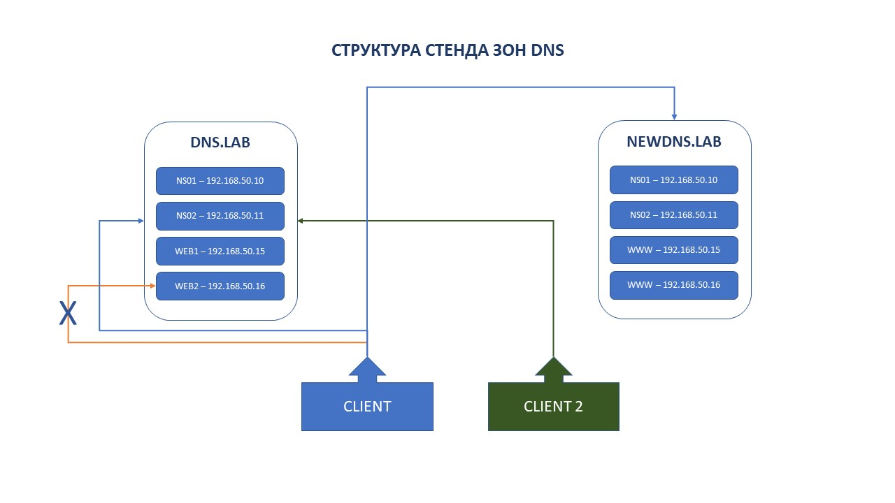
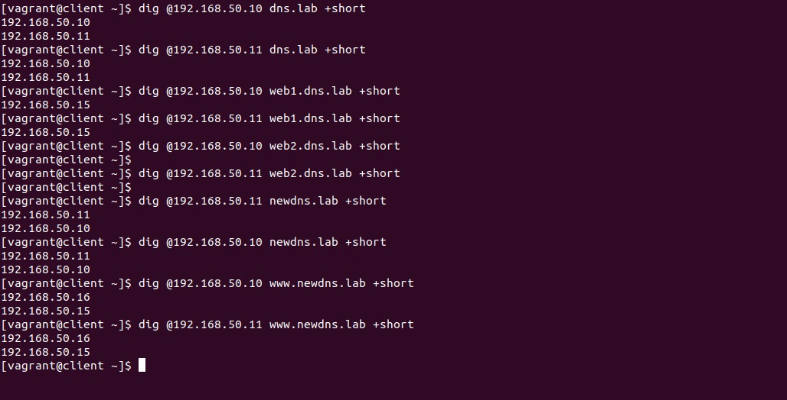
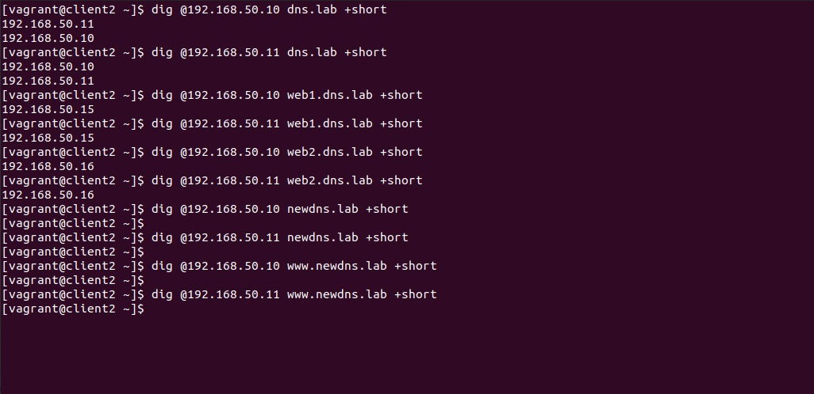

# Lesson 27 (Split DNS)

## Задача 

```
- Взять стенд https://github.com/erlong15/vagrant-bind
- Добавить еще один сервер client2
- Завести в зоне dns.lab
  имена:
    - web1 - смотрит на клиент1
    - web2 смотрит на клиент2

- Завести еще одну зону newdns.lab
- завести в ней запись www: смотрит на обоих клиентов

- настроить split-dns:
    - клиент1 - видит обе зоны, но в зоне dns.lab только web1
    - клиент2 видит только dns.lab

*) настроить все без выключения selinux
```

## Решение 

Подправим исходные файлы развертнывания (приведем к современному виду) [vagrantfile](Vagrantfile) и [playbook.yml](provisioning/playbook.yml) и добавим настройки для client2.


Для разрешения конфликта с SELinux применим контекст безопасности для /etc/named = named_zone_t

```
  - name: Allow SELinux /etc/named
    sefcontext:
      target: '/etc/named(/.*)?'
      setype: named_zone_t
      state: present

  - name: Apply new SELinux file context to /etc/named
    command: restorecon -irv /etc/named
```

https://docs.ansible.com/ansible/2.9/modules/sefcontext_module.html


**Структура стенда DNS**



Создадим требуемые файлы и внесем записи в файлы зон:

* named.dns.lab - файл зоны dns.lab
* named.dns.lab.clinet - файл зоны dns.lab для clinet (тут не будет записи web2)
* named.dns.lab.new - файл зоны newdns.lab

**Настройки сервера BIND для Split-DNS**

В named.conf для мастер сервера добавим значения **acl** и **view**:

```
acl "client" { 192.168.50.15; key client-view; };
acl "client2" { 192.168.50.16; key client2-view; };
```

```
view "client" {
    match-clients {"client"; };
    allow-transfer { key client-view; };
    
    // dns.lab zone for client
    zone "dns.lab" {
        type master;
        file "/etc/named/named.dns.lab.client";
        also-notify { 192.168.50.11 key client-view; };
    };

    // newdns.lab zone for client
    zone "newdns.lab" {
        type master;
        file "/etc/named/named.dns.lab.new";
        also-notify { 192.168.50.11 key client-view; };
    };
};

view "client2" {
    match-clients {"client2"; };
    allow-transfer { key client2-view; };
    
    // dns.lab zone for client2
    zone "dns.lab" {
        type master;
        file "/etc/named/named.dns.lab";
        also-notify { 192.168.50.11 key client2-view; };
    };
};
```

Для защиты от искажений и подделок ответов сервера, передачи зоны и обновлений зоны используем расширения TSIG протокола DNS. Для генерации ключей используем утилиту tsig-keygen (из dnssec-keygen удалили алоритм HMAC - https://gitlab.isc.org/isc-projects/bind9/commit/21761bfe799c8f298e3ce26285426b9a30473e6d?view=parallel).

```
# tsig-keygen -a hmac-md5 client-view

key "client-view" {
        algorithm hmac-md5;
        secret "Qq73iiuLbr45lrlr+odIhA==";
};

# tsig-keygen -a hmac-md5 client2-view
key "client2-view" {
        algorithm hmac-md5;
        secret "Bb/NIRxwzkyfivH4RXfe7A==";
};
```

Необходимые изменения внесем в настройки named.conf для [основного](provisioning/master-named.conf) и [резервного](provisioning/slave-named.conf) серверов DNS.

### Проверка настроек

**Client**



**Client2**

