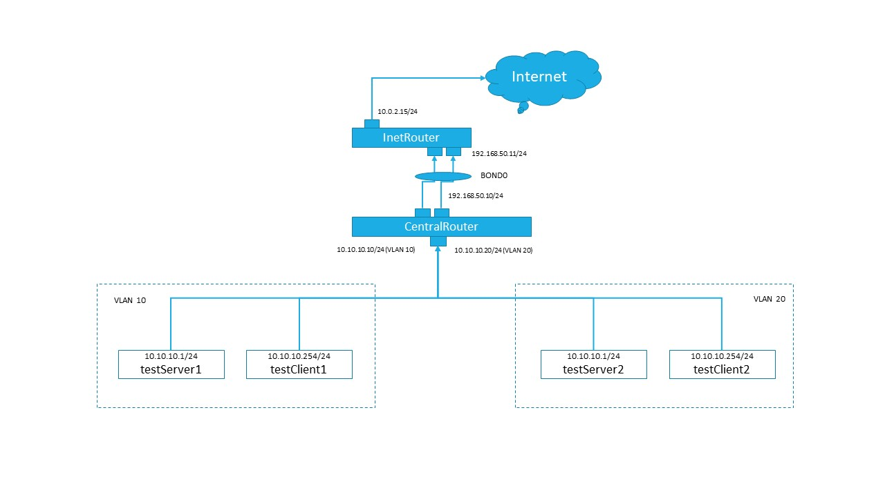

# Lesson 28 (VLAN & LAPC)

## Задача 

```
в Office1 в тестовой подсети появляется сервера с доп интерфесами и адресами 
в internal сети testLAN
- testClient1 - 10.10.10.254
- testClient2 - 10.10.10.254
- testServer1- 10.10.10.1
- testServer2- 10.10.10.1

развести вланами
testClient1 <-> testServer1
testClient2 <-> testServer2

между centralRouter и inetRouter
"пробросить" 2 линка (общая inernal сеть) и объединить их в бонд
проверить работу c отключением интерфейсов
```

## Решение

Решением является настроеный [vagrantfile](Vagrantfile) и ansible [playbook](playbook.yml).

### Схема стенда



#### VLAN

Настраиваем vlan на сетевое устройство через nmcli

```
nmcli con add type vlan ifname VLAN10 dev eth3 id 10 ip4 10.10.10.10/24
```

* имя устройства - VLAN10
* сетевое устройство - eth3
* vlan id - 10 
* ip - 10.10.10.10/24

В результате имеем рабочую схему в Office1 с двумя одинаковыми подсетями (10.10.10.0/24), внутри хосты с одинаковыми IP адресами закрытыми vlan-ами, что позволяет избежать конфликтов IP адресов. 

#### BOND

**Настраиваем bond**

Проверим сетевые соединения:

```
nmcli connection 
```

Создаем интерфейс:

```
nmcli con add type bond con-name bond0 ifname bond0 bond.options "mode=1,miimon=100,fail_over_mac=1" ip4 192.168.50.11/24
```
* имя - bond0
* режиме отказоустойчивости (mode=1 - active-backup)
* ip - 192.168.50.11/24

Добавляем подчиненные сетевые соеденинения в bond. Для каждого интерейса выполняем команду **nmcli con add type bond-slave**:

```
nmcli con add type bond-slave ifname eth1 master bond0
nmcli con add type bond-slave ifname eth2 master bond0
```

Активируем bond:

```
nmcli connection up bond-slave-eth1
nmcli connection up bond-slave-eth2

nmcli con up bond0
```

Паремтры и настройки bond - https://www.kernel.org/doc/Documentation/networking/bonding.txt

https://access.redhat.com/documentation/en-us/red_hat_enterprise_linux/8/html/configuring_and_managing_networking/configuring-network-bonding_configuring-and-managing-networking

https://access.redhat.com/documentation/en-us/red_hat_enterprise_linux/7/html/networking_guide/sec-network_bonding_using_the_networkmanager_command_line_tool_nmcli

Между centralRouter и inetRouter настроен bond в режиме отказоустойчивости (mode=1 - active-backup) с частатой мониторинга канала = 100 мс (miimon=100) и fail_over_mac=1 (mac адрес bond = mac адресу активного сетевого устройства)

**Проверка работы Bond**

Просмотр состояния bond:

```
[root@inetRouter vagrant]# cat /proc/net/bonding/bond0 
Ethernet Channel Bonding Driver: v3.7.1 (April 27, 2011)

Bonding Mode: fault-tolerance (active-backup) (fail_over_mac active)
Primary Slave: None
Currently Active Slave: eth1
MII Status: up
MII Polling Interval (ms): 100
Up Delay (ms): 0
Down Delay (ms): 0

Slave Interface: eth1
MII Status: up
Speed: 1000 Mbps
Duplex: full
Link Failure Count: 0
Permanent HW addr: 08:00:27:78:b6:81
Slave queue ID: 0

Slave Interface: eth2
MII Status: up
Speed: 1000 Mbps
Duplex: full
Link Failure Count: 0
Permanent HW addr: 08:00:27:76:ce:ea
Slave queue ID: 0

```

Отключим сетевой интерфейс eth1 и проверим статус bond0:

```
ip link set eth1 down
```

```
[root@inetRouter vagrant]# cat /proc/net/bonding/bond0 
Ethernet Channel Bonding Driver: v3.7.1 (April 27, 2011)

Bonding Mode: fault-tolerance (active-backup) (fail_over_mac active)
Primary Slave: None
Currently Active Slave: eth2
MII Status: up
MII Polling Interval (ms): 100
Up Delay (ms): 0
Down Delay (ms): 0

Slave Interface: eth1
MII Status: down
Speed: 1000 Mbps
Duplex: full
Link Failure Count: 1
Permanent HW addr: 08:00:27:78:b6:81
Slave queue ID: 0

Slave Interface: eth2
MII Status: up
Speed: 1000 Mbps
Duplex: full
Link Failure Count: 0
Permanent HW addr: 08:00:27:76:ce:ea
Slave queue ID: 0

```
Текущее соединение перешло на интерфейс eth2, соединение не прервано.

```
ip link set eth1 up
```
