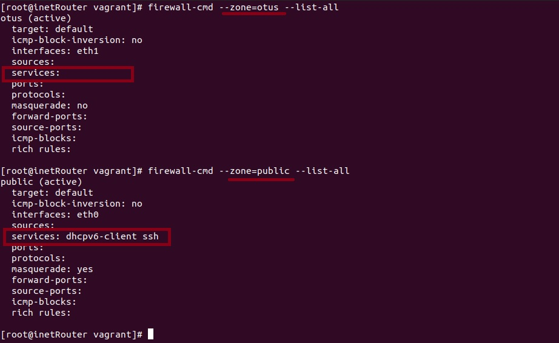
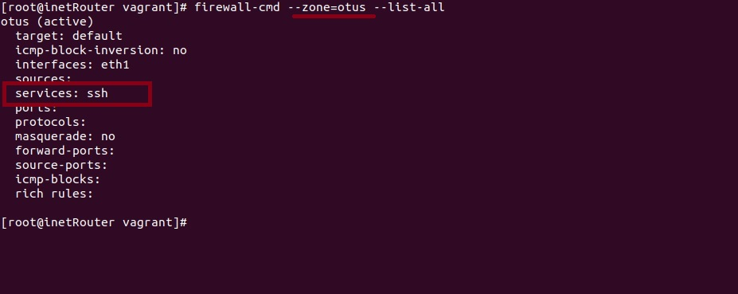
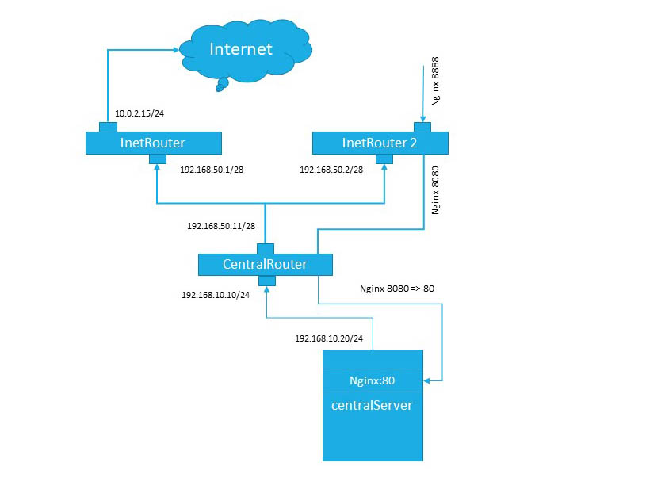
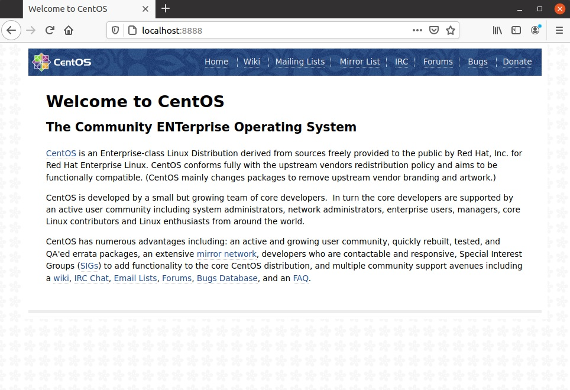
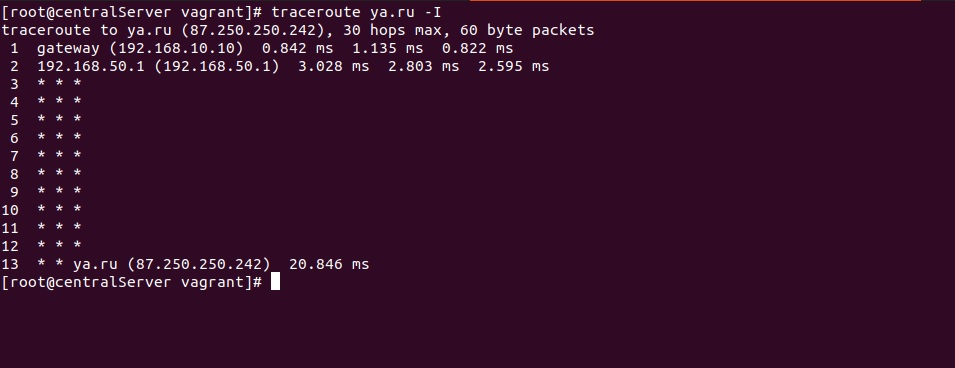

# Lesson 29 (iptables & firewalld)

## Задача

```
Сценарии iptables:

1) реализовать knocking port
   - centralRouter может попасть на ssh inetrRouter через knock скрипт пример в материалах
2) добавить inetRouter2, который виден(маршрутизируется (host-only тип сети для виртуалки)) с хоста 
или форвардится порт через локалхост
3) запустить nginx на centralServer
4) пробросить 80й порт на inetRouter2 8080
5) дефолт в инет оставить через inetRouter

* реализовать проход на 80й порт без маскарадинга
Критерии оценки: 5 - все сделано
```

## Решение

### 1. Реализовать knocking port

Реализация на основе демона knockd. Установим зависимости и сам демон:

```
yum install epel-release 
yum install libpcap
rpm -Uvh http://li.nux.ro/download/nux/misc/el7/x86_64/knock-server-0.7-1.el7.nux.x86_64.rpm
```

Настроим конфигурацию:

```
vi /etc/knockd.conf

[options]
 UseSyslog
 logfile = /var/log/knockd.log

[opencloseSSH]
 sequence = 3333,4444,5555
 seq_timeout = 30
 tcpflags = syn
 start_command = /bin/firewall-cmd --zone=public --add-service=ssh
 cmd_timeout = 30
 stop_command = /bin/firewall-cmd --zone=public --remove-service=ssh

```

start_command и stop_command может иметь и такой формат:

```
start_command = /bin/firewall-cmd --zone=public --add-rich-rule="rule family="ipv4" source address="%IP%" service name="ssh" accept"


stop_command  = /bin/firewall-cmd --zone=public --remove-rich-rule="rule family="ipv4" source address="%IP%" service name="ssh" accept"
```

Данные настройки используют firewalld, можно и правила iptables:

```
start_command = /sbin/iptables -I INPUT 1 -s %IP% -p tcp --dport 22 -j ACCEPT

stop_command  = /sbin/iptables -D INPUT -s %IP% -p tcp --dport ssh -j ACCEPT
```

knockd по умолчанию обращается к eth0, если интерфейс имеет другое наименование, то его необходимо указать в файле /etc/sysconfig/knockd в параметре OPTIONS:

```
OPTIONS="-i eth1"
```


**Проверка работоспособности**

На клиенте (centralRouter) запустим nmap:

```
[root@centralRouter vagrant]# nmap -sV 192.168.50.1 0 ms

Starting Nmap 6.40 ( http://nmap.org ) at 2021-03-10 10:30 UTC
Failed to resolve "ms".
Nmap scan report for 192.168.50.1
Host is up (0.0035s latency).
Not shown: 999 filtered ports
PORT   STATE SERVICE VERSION
22/tcp open  ssh     OpenSSH 7.4 (protocol 2.0)
MAC Address: 08:00:27:C4:86:CE (Cadmus Computer Systems)
```

Удалим сервис ssh из firewalld и проверим еще раз:

```
firewall-cmd --remove-service=ssh
```


```
[root@centralRouter vagrant]# nmap -sV 192.168.50.1 0 ms

Starting Nmap 6.40 ( http://nmap.org ) at 2021-03-10 10:33 UTC
Failed to resolve "ms".
Nmap scan report for 192.168.50.1
Host is up (0.0025s latency).
All 1000 scanned ports on 192.168.50.1 are filtered
MAC Address: 08:00:27:C4:86:CE (Cadmus Computer Systems)
```

```
[root@centralRouter vagrant]# ssh vagrant@192.168.50.1
ssh: connect to host 192.168.50.1 port 22: No route to host
```

Для проверки алгоритма открытие порта для ssh на сервере inetRouter запустим knockd в режиме дебага:

```
knockd -i eth1 -D -vv
``` 

а с клиента (centralRouter) запустим следующее:

```
for i in 3333 4444 5555; do sudo nmap -Pn --host_timeout 100 --max-retries 0 -p $i 192.168.50.1; done
```

Результат:

```
[root@inetRouter vagrant]# knockd -i eth1 -D -vv
config: new section: 'options'
config: usesyslog
config: log file: /var/log/knockd.log
config: new section: 'OpenSSH'
config: OpenSSH: sequence: 3333:tcp,4444:tcp,5555:tcp
config: OpenSSH: seq_timeout: 15
config: tcp flag: SYN
config: OpenSSH: start_command: /bin/firewall-cmd --zone=public --add-rich-rule="rule family="ipv4" source address="%IP%" service name="ssh" accept"
config: new section: 'CloseSSH'
config: CloseSSH: sequence: 6666:tcp,7777:tcp,8888:tcp
config: CloseSSH: seq_timeout: 15
config: tcp flag: SYN
config: CloseSSH: start_command: /bin/firewall-cmd --zone=public --remove-rich-rule="rule family="ipv4" source address="%IP%" service name="ssh" accept"
ethernet interface detected
Local IP: 192.168.50.1
Adding pcap expression for door 'OpenSSH': (dst host 192.168.50.1 and (((tcp dst port 3333 or 4444 or 5555) and tcp[tcpflags] & tcp-syn != 0)))
Adding pcap expression for door 'CloseSSH': (dst host 192.168.50.1 and (((tcp dst port 6666 or 7777 or 8888) and tcp[tcpflags] & tcp-syn != 0)))
listening on eth1...
2021-02-10 10:38:34: tcp: 192.168.50.11:53992 -> 192.168.50.1:3333 60 bytes
192.168.50.11: OpenSSH: Stage 1
2021-02-10 10:38:34: tcp: 192.168.50.11:33134 -> 192.168.50.1:4444 60 bytes
192.168.50.11: OpenSSH: Stage 2
2021-02-10 10:38:35: tcp: 192.168.50.11:56025 -> 192.168.50.1:5555 60 bytes
192.168.50.11: OpenSSH: Stage 3
192.168.50.11: OpenSSH: OPEN SESAME
OpenSSH: running command: /bin/firewall-cmd --zone=public --add-rich-rule="rule family="ipv4" source address="192.168.50.11" service name="ssh" accept"
success
```

Порт открыт:

```
[root@inetRouter vagrant]# firewall-cmd --list-all
public (active)
  target: default
  icmp-block-inversion: no
  interfaces: eth0 eth1
  sources: 
  services: dhcpv6-client ssh
  ports: 
  protocols: 
  masquerade: no
  forward-ports: 
  source-ports: 
  icmp-blocks: 
  rich rules: 
```

Для упрощения запуска создадим скрипт:

```
#!/bin/env bash
HOST=$1
shift
for ARG in "$@"
do
        nmap -Pn --host-timeout 100 --max-retries 0 -p $ARG $HOST
done
```

Запуск:

```
knock.sh 192.168.50.1 3333 4444 5555 
```

```
[root@centralRouter vagrant]# ./knock.sh 192.168.50.1 3333 4444 5555 

Starting Nmap 6.40 ( http://nmap.org ) at 2021-03-10 11:14 UTC
Warning: 192.168.50.1 giving up on port because retransmission cap hit (0).
Nmap scan report for 192.168.50.1
Host is up (0.0012s latency).
PORT     STATE    SERVICE
3333/tcp filtered dec-notes
MAC Address: 08:00:27:1B:52:27 (Cadmus Computer Systems)

Nmap done: 1 IP address (1 host up) scanned in 0.35 seconds

Starting Nmap 6.40 ( http://nmap.org ) at 2021-03-10 11:14 UTC
Warning: 192.168.50.1 giving up on port because retransmission cap hit (0).
Nmap scan report for 192.168.50.1
Host is up (0.0011s latency).
PORT     STATE    SERVICE
4444/tcp filtered krb524
MAC Address: 08:00:27:1B:52:27 (Cadmus Computer Systems)

Nmap done: 1 IP address (1 host up) scanned in 0.34 seconds

Starting Nmap 6.40 ( http://nmap.org ) at 2021-03-10 11:14 UTC
Warning: 192.168.50.1 giving up on port because retransmission cap hit (0).
Nmap scan report for 192.168.50.1
Host is up (0.0016s latency).
PORT     STATE    SERVICE
5555/tcp filtered freeciv
MAC Address: 08:00:27:1B:52:27 (Cadmus Computer Systems)

Nmap done: 1 IP address (1 host up) scanned in 0.34 seconds
```
```
[root@centralRouter vagrant]# ssh vagrant@192.168.50.1
The authenticity of host '192.168.50.1 (192.168.50.1)' can't be established.
ECDSA key fingerprint is SHA256:kWgtShhHzJ6v4kBSp9WXCn1CkgXK92REaXoc7vGlceI.
ECDSA key fingerprint is MD5:94:3c:77:be:48:db:11:a9:ac:b9:49:d4:a1:df:dd:63.
Are you sure you want to continue connecting (yes/no)? 
```

Вместо nmap можно использовать knock на centalRouter 

```
knock 192.168.50.1 2222 3333 4444 -d 100
```

-d = delay - 100 мс между запросами (стуками).

Для обеспечния более сложного подбора нужно использовать неповторяющиеся номера портов. Для более параноидального обеспечения безопасности есть вариант использовать большее количество "стуков" и с перебором протоколов tcp и udp, например:

```
knock 192.168.50.1 6865:tcp 2635:udp 9851:udp 3648:tcp 8624:tcp 4658:udp -d 500
```

**Настройки Firewalld**

Для того чтоб centralRouter мог попасть на ssh inetrRouter через knock скрипт без глобальных перенастроек Vagrant (т.е. мы могли иметь доступ в вируальных хостам через vagrant ssh), перенастроим значения по умолчанию для firewalld.

Задача перенести наш сетевой интерфейс в другую зону и все требования по knock производить для данной зоны (зона - otus).

Создадим новую зону - otus:
```
firewall-cmd --permanent --new-zone=otus
firewall-cmd --reload
```

Проверим:

```
firewall-cmd --get-zones
```

Удалим интерфейс eth1 из зоны public и перенесем в зону otus

```
firewall-cmd --permanent --zone=public --remove-interface=eth1
firewall-cmd --permanent --zone=otus --add-interface=eth1
firewall-cmd --reload
```



Конфигурация /etc/knockd.conf изменится:

```
vi /etc/knockd.conf

[options]
 UseSyslog
 logfile = /var/log/knockd.log

[opencloseSSH]
 sequence = 3333,4444,5555
 seq_timeout = 30
 tcpflags = syn
 start_command = /bin/firewall-cmd --zone=otus --add-service=ssh
 cmd_timeout = 30
 stop_command = /bin/firewall-cmd --zone=otus --remove-service=ssh

```

В итоге при "стуке" в **inetRouter** с **centralRouter** будет открыт порт ssh в зоне **otus**




Работа с зоными firewalld - https://access.redhat.com/documentation/en-us/red_hat_enterprise_linux/7/html/security_guide/sec-working_with_zones

Данный алгоритм реализован в [vagrantfile](vagrantfile). 


### Схема:

Для дельнейшей реализации задания изобразим сетевую схему:




### 2. Добавить inetRouter2, который виден(маршрутизируется (host-only тип сети для виртуалки)) с хоста или форвардится порт через локалхост

```
box.vm.network "forwarded_port", guest: 8080, host: 8888, host_ip: "127.0.0.1"
```

Логика пробросов: 

```
Хост машина:8888 => inetRouter2: 192.168.50.2:8080 => inetRouter2: 192.168.10.20:80 => centralRouter => centralServer 192.168.10.20:80
```
Подробнее об алгоритме прохождения в [п.4](#4-%D0%BF%D1%80%D0%BE%D0%B1%D1%80%D0%BE%D1%81%D0%B8%D1%82%D1%8C-80%D0%B9-%D0%BF%D0%BE%D1%80%D1%82-%D0%BD%D0%B0-inetrouter2-8080)


### 3. Запустить nginx на centralServer 

```
yum install -y epel-release
yum install -y nginx

systemctl enable --now nginx
```

### 4. Пробросить 80й порт на inetRouter2 8080

Данная задача реализована в [vagrantfile](vagrantfile) двумя способами (iptable закоментирован):
* iptable
* firewalld

Для решения задачи надо разобрать логику прохождения пакета при пробросе через шлюз. Пакеты через шлюз проходят такие цепочки: PREROUTING, FORWARD, POSTROUTING и для каждой нужно правило. Для пересылки через шлюз нужно не только подменить адрес назначения (DNAT, PREROUTING), но и заменить адрес источника (SNAT, POSTROUTING), чтобы хост-назначение отвечал хосту-источнику, а не по маршруту по умолчанию. Заменой адреса источника для всех адресатов занимается NAT (MASQUERADE), а для конкретного адресата необходимо настроить парвило SNAT.

Решение для iptable (со ```*``` - без маскарадинга):

```
iptables -t nat -A PREROUTING -i eth0 -p tcp -m tcp --dport 8080 -j DNAT --to-destination 192.168.10.20:80
iptables -t nat -A POSTROUTING --destination 192.168.10.20/32 -j SNAT --to-source 192.168.50.2
```

Решение для firewalld (с маскарадингом и без - со ```*```):


* c маскарадингом
```
firewall-cmd --permanent --add-forward-port=port=8080:proto=tcp:toport=80:toaddr=192.168.10.20

firewall-cmd --permanent --add-masquerade
firewall-cmd --reload
```

* без маскарадинга
```
firewall-cmd --permanent --add-forward-port=port=8080:proto=tcp:toport=80:toaddr=192.168.10.20
firewall-cmd --permanent --direct --passthrough ipv4 -t nat -A POSTROUTING -d 192.168.10.20/32 -p tcp --dport 80 -j SNAT --to-source 192.168.50.2

firewall-cmd --reload
```




### 5. Дефолт в инет оставить через inetRouter

Для всех хостов закрыт маршрут по умолчанию создаваемый Vagrant и прописан свой маршрут:

```
echo "DEFROUTE=no" >> /etc/sysconfig/network-scripts/ifcfg-eth0 
echo "GATEWAY=192.168.10.10" >> /etc/sysconfig/network-scripts/ifcfg-eth1
```

Для проверки достаточно запустить traceroute:


