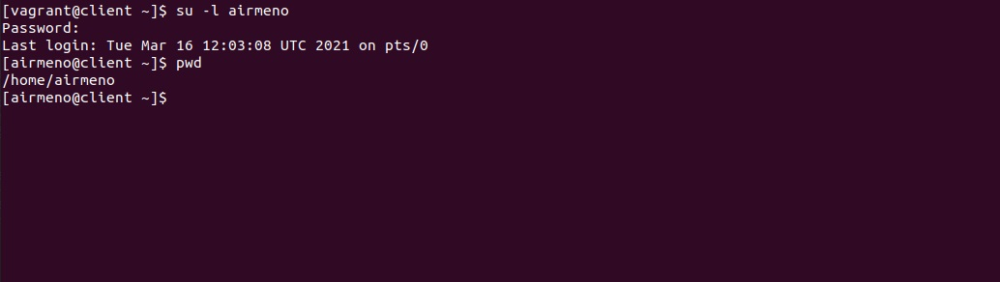
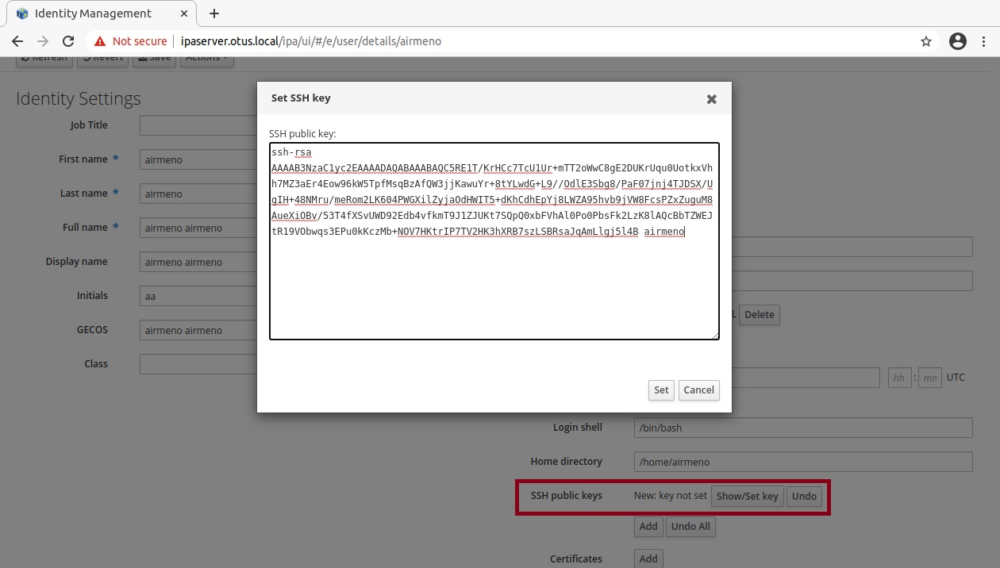
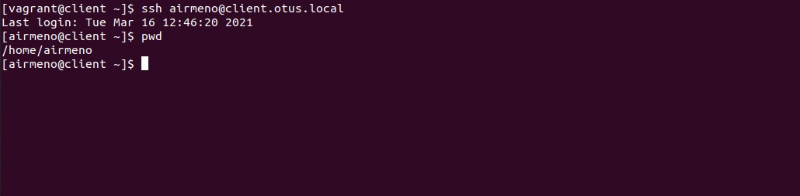

# Lesson 30 (LDAP / FreeIPA)

## Задача

```
LDAP

1.   Установить FreeIPA;
2.   Написать Ansible playbook для конфигурации клиента;
3*.  Настроить аутентификацию по SSH-ключам;
4**. Firewall должен быть включен на сервере и на клиенте.

В git - результирующий playbook.
```

## Решение


### Установка FreeIPA

Для установки сервера FreeIPA необходимо произвести первоначальные настройки сервера:

```
Server: ipaserver.otus.local
IP: 192.168.50.10

Client: client.otus.local
IP: 192.168.50.11
```

файл /etc/hosts содержит записи сервера и клиента:

```
192.168.50.10 ipaserver.otus.local  ipaserver
192.168.50.11 client.otus.local  client
```

Установка пакетов:

```
yum install ipa-server ipa-server-dns bind bind-dyndb-ldap
```

Установка сервера:

```
ipa-server-install 

--hostname=ipaserver.otus.local
--domain=otus.local 
--realm=OTUS.LOCAL 
--ds-password=Pa$$w0rd
--admin-password=Pa$$w0rd
--mkhomedir (создавать домашние директории пользователей)
--setup-dns (интегрированной (BIND))
--forwarder=8.8.8.8 (перенаправление запросов DNS при отсутсвии записи в интегрированном BIND)

```

**Настройки Firewalld**

Запустим файрвол и проверим:

```
systemctl start firewalld.service

systemctl status firewalld.service
```
Настройки сервисов firewalld

```
firewall-cmd --permanent --zone=public --add-service={ntp,http,https,ldap,ldaps,kerberos,kpasswd,dns}
firewall-cmd --reload

firewall-cmd --list-all --zone=public
```

#### Проверка сервера 

Получить билет kerberos:

```
kinit admin
```

Проверим полученный билет:

```
klist
```

Вывод информацию о пользователе:

```
ipa user-show --all admin
```

**Панель управления FreeIPA**

Доступен по адресу - https://ipaserver.otus.local/ipa/ui (user: admin; password: Pa$$w0rd)

> Если используем тестовую среду, то необходимо прописать на хост машине в **hosts** адрес нашего сервера FreeIPA. Запросы на web-сервер проходят через доменное имя сервера:

```
192.168.50.10 ipaserver.otus.local
```

Все настройки сервера которые производили при установке доступны через веб интерфейс Панели управления FreeIPA.


#### Проверка подключения от клиента

Подготовка клиента:

```
cat /etc/hosts

192.168.50.10 ipaserver.otus.local  ipaserver
192.168.50.11 client.otus.local  client
```

```
cat /etc/resolv.conf

nameserver 192.168.50.10
```

Установка:

```
yum install freeipa-client
```

Конфигурирование клиента:

```
ipa-client-install --mkhomedir --force-ntpd
```

* --mkhomedir - автоматом создавать домашние директории
* --force-ntpd - настроить синхронизацию времени. 

> точность времени очень важный фактор для kerberos. Допустимое отклонние времени между сервером и клиентов до 5 минут. 

На основе данных из DNS система определит настройки и отобразить их в консоли:

```
[root@client vagrant]# ipa-client-install --mkhomedir --force-ntpd

Discovery was successful!
Client hostname: client.otus.local
Realm: OTUS.LOCAL
DNS Domain: otus.local
IPA Server: ipaserver.otus.local
BaseDN: dc=otus,dc=local
```

Конфигурируем согласно полученным настройкам, на вопрос от имени какого пользователя совершать настройки - вводим admin и пароль:

```
User authorized to enroll computers: admin
```

Проверим подключение:

```
[root@client vagrant]# kinit admin
Password for admin@OTUS.LOCAL: 


[root@client vagrant]# klist
Ticket cache: KEYRING:persistent:0:0
Default principal: admin@OTUS.LOCAL

Valid starting       Expires              Service principal
03/15/2021 14:57:25  03/16/2021 14:57:21  krbtgt/OTUS.LOCAL@OTUS.LOCAL

```

**Настройки Firewalld**


```
firewall-cmd --permanent --zone=public --add-service=ntp
firewall-cmd --reload
```

### Создание пользователей

Кроме возможности создавать пользователей через веб-интерфейс, рассмотрим возможность работы через командную строку:

Авторизуемся на FreeIPA:
```
kinit admin
```

Создаем нового пользователя:

```
ipa user-add vivanov --first=Vasiliy --last=Ivanov --password

или 

ipa user-add vivanov --first=Vasiliy --last=Ivanov --cn="Vasiliy Ivanov" --displayname="asiliy Ivanov" --email=viavanov@otus.local --password
```

* cn — полное имя.
* displayname — отображаемое имя.
* email — адрес электронной почты.

Полный список атрибутов - https://docs.fedoraproject.org/en-US/Fedora/15/html/FreeIPA_Guide/managing-users.html


## Установка и конфигурирование через Ansible

Скачиваем на [github freeipa](https://github.com/freeipa/ansible-freeipa) готовые роли для установки сервера и клиента FreeIPA.


**Настриваем [playbook](provision/install-server.yml) установки сервера:**

* переменные (конфигурация) сервера - https://github.com/freeipa/ansible-freeipa/tree/master/roles/ipaserver#variables
* настройка файла /etc/hosts


**Настриваем [playbook](provision/install-client.yml) установки клиента:**

* переменные (конфигурация) клиента - https://github.com/freeipa/ansible-freeipa/tree/master/roles/ipaserver#client-variables
* настройка файла /etc/resolv.conf
* настройка файла /etc/hosts
* настройка (включение) файрвола 

Все настройки и конфигурации автоматически разворачиваются через [vagrantfile](vagrantfile).


**Добавление пользователя**

В файл плейбука добавим задачу:

```
    - name: Add User
      ipa_user:
        name: airmeno
        state: present
        givenname: airmeno
        sn: airmeno
        password: Pa$$w0rd
        ipa_host: ipaserver.otus.local
        ipa_user: admin
        ipa_pass: Pa$$w0rd
```

Проверим на клиенте виден ли созданный пользователь:

```
[vagrant@client ~]$ ipa user-find airmeno
--------------
1 user matched
--------------
  User login: airmeno
  First name: airmeno
  Last name: airmeno
  Home directory: /home/airmeno
  Login shell: /bin/bash
  Principal name: airmeno@OTUS.LOCAL
  Principal alias: airmeno@OTUS.LOCAL
  Email address: airmeno@otus.local
  UID: 502200001
  GID: 502200001
  Account disabled: False
----------------------------
Number of entries returned 1
----------------------------

```

```
[vagrant@client ~]$ getent passwd airmeno@otus.local

airmeno:*:502200001:502200001:airmeno airmeno:/home/airmeno:/bin/bash
```




### Настройка по SSH ключам

Пользователи и хосты проходят аутентификацию:
* Пользователи аутентифицируются сервером sshd
* Хосты аутентифицируются клиентом ssh


Аутентификация пользователя в sshd
* Закрытый ключ пользователя хранится на клиенте.( ~/.ssh/id_rsa )
* Открытые ключи пользователя хранятся на сервере.( ~/.ssh/authorized_keys )


Аутентификация хоста в ssh
* Закрытый ключ хоста хранится на сервере ```/etc/ssh/ssh_host_rsa_key```
* Имена хостов и их соответствующие открытые ключи сохраняются на клиенте ``` ~/.ssh/known_hosts```

Сгенериуем пару ssh ключей для пользователя:

```
ssh-keygen
```

Публичный ключ передадим на сервер FreeIPA через веб-интерфейс или команду:

```
ipa user-mod user –sshpubkey='ssh-rsa AAAA…'
```



Попробуем соединиться с сервером через ssh:


Пароль не был запрошен, соединение установлено через ключ ssh. Никаких передач открытых ключей нет.





> Подробнее о SSH - https://www.freeipa.org/images/1/10/Freeipa30_SSSD_OpenSSH_integration.pdf


Для создания пользователя с уже сгененрированным открытым ключом внесем изменения в наш playbook:

```
    - name: Add User
      ipa_user:
        name: airmeno
        state: present
        givenname: airmeno
        sn: airmeno
        sshpubkey:
        - ssh-rsa AAAAB3NzaC1yc2EAAAADAQABAAABAQC5RE1T/KrHCc7TcU1Ur+mTT2oWwC8gE2DUKrUqu0UotkxVhh7MZ3aEr4Eow96kW5TpfMsqBzAfQW3jjKawuYr+8tYLwdG+L9//OdlE3Sbg8/PaF07jnj4TJDSX/UgIH+48NMru/meRom2LK604PWGXilZyjaOdHWIT5+dKhCdhEpYj8LWZA95hvb9jVW8FcsPZxZuguM8AueXiOBv/53T4fXSvUWD92Edb4vfkmT9J1ZJUKt7SQpQ0xbFVhAl0Po0PbsFk2LzK8lAQcBbTZWEJtR19VObwqs3EPu0kKczMb+NOV7HKtrIP7TV2HK3hXRB7szLSBRsaJqAmLlgj5l4B airmeno
        password: Pa$$w0rd
        ipa_host: ipaserver.otus.local
        ipa_user: admin
        ipa_pass: Pa$$w0rd
```
