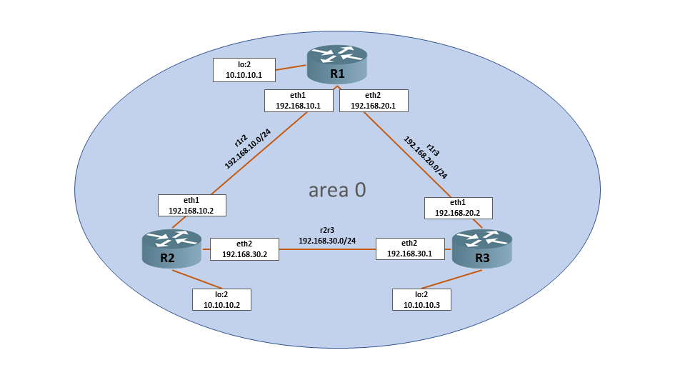

# Lesson 31 (OSPF / Динамическая маршрутизация)

## Задача

```
1. Поднять три виртуалки. Объединить их разными vlan (private network);
2. Поднять OSPF между машинами на базе Quagga;
3. Изобразить ассиметричный роутинг;
4. Сделать один из линков "дорогим", но что бы при этом роутинг был симметричным.
```

## Решение

Схема стенда



Решением будет [vagrantfile](vagrantfile) и [ansible playbook](playbook.yml) автоматически разворачивающий стенд с необходимыми настройками (с ассиметричным роутингом).

Для объединения подсетей 192.168.10.0/24, 192.168.20.0/24 и 192.168.30.0/24 с помощью OSPF будем использовать решение на Quagga (FRR).

Quagga — пакет свободного программного обеспечения для UNIX-подобных ОС, поддерживающий протоколы динамической маршрутизации IP (RIP, OSPF, BGP, IS-IS, PIM). Quagga — это усовершенствованная версия GNU Zebra.

Более свежая реализация - FRRouting (FRR), основан на Quagga.

## 1. Поднять OSPF между машинами на базе Quagga

### Настройка ядра Linux:

* форвард (переслыка) пакетов между интерфейсами - включить
* Проверка маршрута источника (режим фильтрации пакетов на всех интерфейсах) - отключить = 0, мягкий режим = 2 (для реализации асимметричного роутинга)

```
net.ipv4.ip_forward=1
net.ipv4.conf.all.rp_filter=2
```

На всех роутерах произведем данные настройки:

```
echo "net.ipv4.ip_forward = 1" > /etc/sysctl.d/ip_forwarding.conf
echo "net.ipv4.conf.all.rp_filter = 2" >> /etc/sysctl.d/ip_forwarding.conf
systemctl restart network
```

### Настройки сети и файрвола

На роутерах создадим дополнительный loopback-интерфейс `lo:2` с уникальным ip адресом в сети. Данный ip адрес будет являться `router-id` и нести смысл stub network. Адреса будут 10.10.10.{1,2,3} с маской 32. 

Создаем конфигурационный файл `/etc/sysconfig/network-scripts/ifcfg-lo.2` на всех роутерах:
```
cat > /etc/sysconfig/network-scripts/ifcfg-lo.2 <<EOF
DEVICE=lo:2
IPADDR=10.10.10.1
PREFIX=32
NETWORK=10.10.10.1
ONBOOT=yes
EOF

systemctl restart network
```

Если включен файрвол, на всех роутерах необходимо разрешить протокол 89:

```
firewall-cmd --add-protocol=ospf --permanent
firewall-cmd --reload
```

### Установка пакетов

В CentOS 7 в базовом репозитории есть Quagga, а в CentOS 8 - FRR. Конфигурация и настройка идентичны. В зависимости от установленной версии CentOS ставим пакеты на все роутеры:

```
CentOS 7
========
yum install quagga

systemctl enable zebra.service --now

Centos 8
========
dnf install frr

systemctl enable frr.service --now
```

> Дополнительно будет установлен пакет `tcpdump`.


Для работы демона ospfd создаем конфигурационный файл `/etc/quagga/ospfd.conf` с правами `quagga:quaggavt` или копируем с `/usr/share/doc/quagga/ospfd.conf.sample`. После запускаем ospfd:

```
touch /etc/quagga/ospfd.conf
chown quagga:quaggavt /etc/quagga/ospfd.conf

systemctl enable ospfd.service --now
```

в FRR необходимо внести изменения в файл /etc/frr/daemons

```
vi /etc/frr/daemons

zebra=yes
ospfd=yes
```

### Настройка SELinux

Разрешим в selinux контекст безопасности zebra_write_config:

```
setsebool -P zebra_write_config 1
```

> https://linux.die.net/man/8/zebra_selinux

### Настройка динамического роутинга


Если необходимы определить интервалы для интерфейсов:

* HelloInterval - по-умолчанию 10 сек
* RouterDeadInterval - по-умолчанию 40 сек

```
interface eth[X]

ip ospf hello-interval 5
ip ospf dead-interval 10
```

С помощью утилиты `vtysh` конфигурируем ospf на роутерах в соотвествии с заданными настройками сети:

```
[root@r1 ~]# vtysh

Hello, this is Quagga (version 0.99.22.4).
Copyright 1996-2005 Kunihiro Ishiguro, et al.

r1# conf t
r1(config)# router ospf 
r1(config-router)# router-id 10.10.10.1
r1(config-router)# passive-interface default
r1(config-router)# no passive-interface eth1
r1(config-router)# no passive-interface eth2
r1(config-router)# network 10.10.10.1/32 area 0
r1(config-router)# network 192.168.10.0/24 area 0
r1(config-router)# network 192.168.20.0/24 area 0
r1(config-router)# do write
Building Configuration...
Configuration saved to /etc/quagga/zebra.conf
Configuration saved to /etc/quagga/ospfd.conf
[OK]
```

> https://www.quagga.net/docs/quagga.html#OSPFv2

Аналогично настроим роутеры `r2` и  `r3`. Проверим таблицу роутинга:

```
[root@r1 ~]# ip r
default via 10.0.2.2 dev eth0 proto dhcp metric 100 
10.0.2.0/24 dev eth0 proto kernel scope link src 10.0.2.15 metric 100 
10.10.10.2 via 192.168.10.2 dev eth1 proto zebra metric 20 
10.10.10.3 via 192.168.20.2 dev eth2 proto zebra metric 20 
192.168.10.0/24 dev eth1 proto kernel scope link src 192.168.10.1 metric 101 
192.168.20.0/24 dev eth2 proto kernel scope link src 192.168.20.1 metric 102 
192.168.30.0/24 proto zebra metric 20 
	nexthop via 192.168.10.2 dev eth1 weight 1 
	nexthop via 192.168.20.2 dev eth2 weight 1 
```

```
[root@r2 ~]# ip r
default via 10.0.2.2 dev eth0 proto dhcp metric 100 
10.0.2.0/24 dev eth0 proto kernel scope link src 10.0.2.15 metric 100 
10.10.10.1 via 192.168.10.1 dev eth1 proto zebra metric 20 
10.10.10.3 via 192.168.30.1 dev eth2 proto zebra metric 20 
192.168.10.0/24 dev eth1 proto kernel scope link src 192.168.10.2 metric 101 
192.168.20.0/24 proto zebra metric 20 
	nexthop via 192.168.10.1 dev eth1 weight 1 
	nexthop via 192.168.30.1 dev eth2 weight 1 
192.168.30.0/24 dev eth2 proto kernel scope link src 192.168.30.2 metric 102 
```

```
[root@r3 ~]# ip r
default via 10.0.2.2 dev eth0 proto dhcp metric 100 
10.0.2.0/24 dev eth0 proto kernel scope link src 10.0.2.15 metric 100 
10.10.10.1 via 192.168.20.1 dev eth1 proto zebra metric 20 
10.10.10.2 via 192.168.30.2 dev eth2 proto zebra metric 20 
192.168.10.0/24 proto zebra metric 20 
	nexthop via 192.168.20.1 dev eth1 weight 1 
	nexthop via 192.168.30.2 dev eth2 weight 1 
192.168.20.0/24 dev eth1 proto kernel scope link src 192.168.20.2 metric 101 
192.168.30.0/24 dev eth2 proto kernel scope link src 192.168.30.1 metric 102 
```

Или через утилиту `vtysh`:

```
r3# sh ip ro
Codes: K - kernel route, C - connected, S - static, R - RIP,
       O - OSPF, I - IS-IS, B - BGP, A - Babel,
       > - selected route, * - FIB route

O   0.0.0.0/0 [110/10] via 192.168.20.1, eth1, 00:02:13
                       via 192.168.30.2, eth2, 00:02:13
K>* 0.0.0.0/0 via 10.0.2.2, eth0
C>* 10.0.2.0/24 is directly connected, eth0
O>* 10.10.10.1/32 [110/20] via 192.168.20.1, eth1, 00:02:19
O>* 10.10.10.2/32 [110/20] via 192.168.30.2, eth2, 00:02:14
O   10.10.10.3/32 [110/10] is directly connected, lo, 00:02:44
C>* 10.10.10.3/32 is directly connected, lo
C>* 127.0.0.0/8 is directly connected, lo
O>* 192.168.10.0/24 [110/20] via 192.168.20.1, eth1, 00:02:14
  *                          via 192.168.30.2, eth2, 00:02:14
O   192.168.20.0/24 [110/10] is directly connected, eth1, 00:02:39
C>* 192.168.20.0/24 is directly connected, eth1
O   192.168.30.0/24 [110/10] is directly connected, eth2, 00:02:20
C>* 192.168.30.0/24 is directly connected, eth2
```

Проверим стотояние LSDB (Link State Database):

```
r1# show ip ospf database

       OSPF Router with ID (10.10.10.1)

                Router Link States (Area 0.0.0.0)

Link ID         ADV Router      Age  Seq#       CkSum  Link count
10.10.10.1      10.10.10.1       213 0x80000008 0x7a50 3
10.10.10.2      10.10.10.2       198 0x80000008 0x951b 3
10.10.10.3      10.10.10.3       198 0x80000008 0x3763 3

                Net Link States (Area 0.0.0.0)

Link ID         ADV Router      Age  Seq#       CkSum
192.168.10.1    10.10.10.1       327 0x80000001 0xe0a6
192.168.20.1    10.10.10.1       213 0x80000001 0x80fb
192.168.30.2    10.10.10.2       198 0x80000001 0x0867

                AS External Link States

Link ID         ADV Router      Age  Seq#       CkSum  Route
0.0.0.0         10.10.10.1       213 0x80000003 0x4c5b E2 0.0.0.0/0 [0x0]
0.0.0.0         10.10.10.2       198 0x80000002 0x485f E2 0.0.0.0/0 [0x0]
0.0.0.0         10.10.10.3       198 0x80000001 0x4463 E2 0.0.0.0/0 [0x0]
```

Командой `show ip ospf database router [router-id]` можно посметреть LSA на маршрутизаторе:

```
r1# show ip ospf database router 10.10.10.3

       OSPF Router with ID (10.10.10.1)


                Router Link States (Area 0.0.0.0)

  LS age: 377
  Options: 0x2  : *|-|-|-|-|-|E|*
  LS Flags: 0x6  
  Flags: 0x2 : ASBR
  LS Type: router-LSA
  Link State ID: 10.10.10.3 
  Advertising Router: 10.10.10.3
  LS Seq Number: 80000008
  Checksum: 0x3763
  Length: 60
   Number of Links: 3

    Link connected to: Stub Network
     (Link ID) Net: 10.10.10.3
     (Link Data) Network Mask: 255.255.255.255
      Number of TOS metrics: 0
       TOS 0 Metric: 10

    Link connected to: a Transit Network
     (Link ID) Designated Router address: 192.168.20.1
     (Link Data) Router Interface address: 192.168.20.2
      Number of TOS metrics: 0
       TOS 0 Metric: 10

    Link connected to: a Transit Network
     (Link ID) Designated Router address: 192.168.30.2
     (Link Data) Router Interface address: 192.168.30.1
      Number of TOS metrics: 0
       TOS 0 Metric: 10
```

Тут видна информация о транзитных сетях (Transit Network) и сетях заглушках (Stub Network), метриках.

Посмотреть Network-LSA на маршрутизаторе:

```
r1# show ip ospf database network 192.168.10.1

       OSPF Router with ID (10.10.10.1)


                Net Link States (Area 0.0.0.0)

  LS age: 169
  Options: 0x2  : *|-|-|-|-|-|E|*
  LS Flags: 0x3  
  LS Type: network-LSA
  Link State ID: 192.168.10.1 (address of Designated Router)
  Advertising Router: 10.10.10.1
  LS Seq Number: 80000001
  Checksum: 0xe0a6
  Length: 32
  Network Mask: /24
        Attached Router: 10.10.10.1
        Attached Router: 10.10.10.2
```

Видим, что 192.168.10.1 соседствует с маршрутизаторами 10.10.10.1 и 10.10.10.2.


Содержимое конфигурационных файлов `/etc/quagga/zebra.conf` и `/etc/quagga/ospfd.conf`, на их основе создадим шаблоны j2 для ansible:

<details>
  <summary>На примере r1:</summary>

```
[root@r1 ~]# cat /etc/quagga/zebra.conf
!
! Zebra configuration saved from vty
!   2021/03/26 08:33:24
!
hostname r1
!
interface eth0
 ipv6 nd suppress-ra
!
interface eth1
 ipv6 nd suppress-ra
!
interface eth2
 ipv6 nd suppress-ra
!
interface lo
!
ip forwarding
!
!
line vty
!
```  

```
[root@r1 ~]# cat /etc/quagga/ospfd.conf
!
! Zebra configuration saved from vty
!   2021/03/26 08:33:24
!
hostname ospfd
password zebra
log stdout
!
!
!
interface eth0
!
interface eth1
!
interface eth2
!
interface lo
!
router ospf
 ospf router-id 10.10.10.1
 passive-interface default
 no passive-interface eth1
 no passive-interface eth2
 network 10.10.10.1/32 area 0.0.0.0
 network 192.168.10.0/24 area 0.0.0.0
 network 192.168.20.0/24 area 0.0.0.0
 default-information originate
!
line vty
!
```
</details>


## 2. Изобразить ассиметричный роутинг

Протестируем прохождение пакетов между `r2` и `r3`, запустим ping c 10.10.10.2 на 10.10.10.3

```
[root@r2 ~]# ip route get 10.10.10.3
10.10.10.3 via 192.168.30.1 dev eth2 src 192.168.30.2 

[root@r3 ~]# ip route get 10.10.10.2
10.10.10.2 via 192.168.30.2 dev eth2 src 192.168.30.1 

[root@r2 ~]# ping -I 10.10.10.2 10.10.10.3
PING 10.10.10.3 (10.10.10.3) from 10.10.10.2 : 56(84) bytes of data.
64 bytes from 10.10.10.3: icmp_seq=1 ttl=64 time=0.891 ms
64 bytes from 10.10.10.3: icmp_seq=2 ttl=64 time=5.66 ms
64 bytes from 10.10.10.3: icmp_seq=3 ttl=64 time=7.97 ms
64 bytes from 10.10.10.3: icmp_seq=4 ttl=64 time=4.15 ms
64 bytes from 10.10.10.3: icmp_seq=5 ttl=64 time=1.93 ms
64 bytes from 10.10.10.3: icmp_seq=6 ttl=64 time=3.10 ms
64 bytes from 10.10.10.3: icmp_seq=7 ttl=64 time=1.84 ms
64 bytes from 10.10.10.3: icmp_seq=8 ttl=64 time=0.938 ms
```

```
[root@r2 ~]# tcpdump -i eth2 -n
tcpdump: verbose output suppressed, use -v or -vv for full protocol decode
listening on eth1, link-type EN10MB (Ethernet), capture size 262144 bytes

09:42:33.210687 IP 10.10.10.2 > 10.10.10.3: ICMP echo request, id 26337, seq 1, length 64
09:42:33.211528 IP 10.10.10.3 > 10.10.10.2: ICMP echo reply, id 26337, seq 1, length 64
09:42:34.213049 IP 10.10.10.2 > 10.10.10.3: ICMP echo request, id 26337, seq 2, length 64
09:42:34.218620 IP 10.10.10.3 > 10.10.10.2: ICMP echo reply, id 26337, seq 2, length 64
09:42:35.215310 IP 10.10.10.2 > 10.10.10.3: ICMP echo request, id 26337, seq 3, length 64
09:42:35.223190 IP 10.10.10.3 > 10.10.10.2: ICMP echo reply, id 26337, seq 3, length 64
09:42:36.217383 IP 10.10.10.2 > 10.10.10.3: ICMP echo request, id 26337, seq 4, length 64
09:42:36.221498 IP 10.10.10.3 > 10.10.10.2: ICMP echo reply, id 26337, seq 4, length 64
09:42:37.220384 IP 10.10.10.2 > 10.10.10.3: ICMP echo request, id 26337, seq 5, length 64
09:42:37.222278 IP 10.10.10.3 > 10.10.10.2: ICMP echo reply, id 26337, seq 5, length 64
```

Пакеты уходят и приходят симетрично, т.е. на интерфейс `eth2`.

Повысим стоимость интерфейса `eth2` на `r3`, OSPF перестроит таблицу маршрутизации и проверим:

```
[root@r3 ~]# vtysh 

Hello, this is Quagga (version 0.99.22.4).
Copyright 1996-2005 Kunihiro Ishiguro, et al.

r3# conf t
r3(config)# int eth2
r3(config-if)# ip ospf  cost  1000
```

```
[root@r2 ~]# ip route get 10.10.10.3
10.10.10.3 via 192.168.30.1 dev eth2 src 192.168.30.2 

[root@r3 ~]# ip route get 10.10.10.2
10.10.10.2 via 192.168.20.1 dev eth1 src 192.168.20.2

[root@r2 ~]# ping -I 10.10.10.2 10.10.10.3
PING 10.10.10.3 (10.10.10.3) from 10.10.10.2 : 56(84) bytes of data.
64 bytes from 10.10.10.3: icmp_seq=1 ttl=63 time=1.08 ms
64 bytes from 10.10.10.3: icmp_seq=2 ttl=63 time=3.40 ms
64 bytes from 10.10.10.3: icmp_seq=3 ttl=63 time=10.4 ms
64 bytes from 10.10.10.3: icmp_seq=4 ttl=63 time=4.82 ms

[root@r2 ~]# tcpdump -i eth2 -n
tcpdump: verbose output suppressed, use -v or -vv for full protocol decode
listening on eth2, link-type EN10MB (Ethernet), capture size 262144 bytes
09:48:08.554837 IP 10.10.10.2 > 10.10.10.3: ICMP echo request, id 26341, seq 7, length 64
09:48:09.557003 IP 10.10.10.2 > 10.10.10.3: ICMP echo request, id 26341, seq 8, length 64
09:48:10.557915 IP 10.10.10.2 > 10.10.10.3: ICMP echo request, id 26341, seq 9, length 64
09:48:11.560650 IP 10.10.10.2 > 10.10.10.3: ICMP echo request, id 26341, seq 10, length 64
09:48:12.562901 IP 10.10.10.2 > 10.10.10.3: ICMP echo request, id 26341, seq 11, length 64

[root@r2 ~]# tcpdump -i eth1 -n
tcpdump: verbose output suppressed, use -v or -vv for full protocol decode
listening on eth1, link-type EN10MB (Ethernet), capture size 262144 bytes
09:49:23.428386 IP 10.10.10.3 > 10.10.10.2: ICMP echo reply, id 26344, seq 6, length 64
09:49:24.429570 IP 10.10.10.3 > 10.10.10.2: ICMP echo reply, id 26344, seq 7, length 64
09:49:25.431660 IP 10.10.10.3 > 10.10.10.2: ICMP echo reply, id 26344, seq 8, length 64
09:49:26.434568 IP 10.10.10.3 > 10.10.10.2: ICMP echo reply, id 26344, seq 9, length 64
09:49:27.435122 IP 10.10.10.3 > 10.10.10.2: ICMP echo reply, id 26344, seq 10, length 64
09:49:28.440124 IP 10.10.10.3 > 10.10.10.2: ICMP echo reply, id 26344, seq 11, length 64
09:49:29.445184 IP 10.10.10.3 > 10.10.10.2: ICMP echo reply, id 26344, seq 12, length 64

```
Как видим icmp запросы приходят на `eth2`, а ответы возвращаются через `eth1`.


## 3. Сделать один из линков "дорогим", но чтобы при этом роутинг был симметричным

Чтобы восстановить "симметричность" роутинга, не меняя стоимость "дорогого" интерфейса `eth2`, поднимем стоимость интерфейса `eth1` на `r3` = 1000, как у `eth2`.

```
[root@r3 ~]# ip route get 10.10.10.2
10.10.10.2 via 192.168.30.2 dev eth2 src 192.168.30.1 
```
Кратчайший маршрут восстановился и пинги идут симетрично:

```
[root@r2 ~]# ping -I 10.10.10.2 10.10.10.3
PING 10.10.10.3 (10.10.10.3) from 10.10.10.2 : 56(84) bytes of data.
64 bytes from 10.10.10.3: icmp_seq=1 ttl=64 time=0.768 ms
64 bytes from 10.10.10.3: icmp_seq=2 ttl=64 time=3.92 ms
64 bytes from 10.10.10.3: icmp_seq=3 ttl=64 time=2.51 ms
64 bytes from 10.10.10.3: icmp_seq=4 ttl=64 time=2.65 ms
64 bytes from 10.10.10.3: icmp_seq=5 ttl=64 time=2.76 ms
64 bytes from 10.10.10.3: icmp_seq=6 ttl=64 time=1.97 ms

[root@r2 ~]# tcpdump -i eth2 -n
tcpdump: verbose output suppressed, use -v or -vv for full protocol decode
listening on eth2, link-type EN10MB (Ethernet), capture size 262144 bytes
09:55:33.875891 IP 10.10.10.2 > 10.10.10.3: ICMP echo request, id 26348, seq 7, length 64
09:55:33.881767 IP 10.10.10.3 > 10.10.10.2: ICMP echo reply, id 26348, seq 7, length 64
09:55:34.878952 IP 10.10.10.2 > 10.10.10.3: ICMP echo request, id 26348, seq 8, length 64
09:55:34.882645 IP 10.10.10.3 > 10.10.10.2: ICMP echo reply, id 26348, seq 8, length 64
09:55:35.880047 IP 10.10.10.2 > 10.10.10.3: ICMP echo request, id 26348, seq 9, length 64
09:55:35.882986 IP 10.10.10.3 > 10.10.10.2: ICMP echo reply, id 26348, seq 9, length 64
```

## Результат

1. Vagrant автоматически разворачивает стенд представленный на схеме с ассиметричным роутингом (стоимость на интерфейсе роутера `r3` `eth2` = 1000). Разворачивание происходить через Ansible.

```
[root@r3 ~]# vtysh

Hello, this is Quagga (version 0.99.22.4).
Copyright 1996-2005 Kunihiro Ishiguro, et al.

r3# show ip ospf database router 10.10.10.3

       OSPF Router with ID (10.10.10.3)


                Router Link States (Area 0.0.0.0)

  LS age: 228
  Options: 0x2  : *|-|-|-|-|-|E|*
  LS Flags: 0x3  
  Flags: 0x0
  LS Type: router-LSA
  Link State ID: 10.10.10.3 
  Advertising Router: 10.10.10.3
  LS Seq Number: 80000008
  Checksum: 0x19a1
  Length: 60
   Number of Links: 3

    Link connected to: a Transit Network
     (Link ID) Designated Router address: 192.168.20.1
     (Link Data) Router Interface address: 192.168.20.2
      Number of TOS metrics: 0
       TOS 0 Metric: 10

    Link connected to: a Transit Network
     (Link ID) Designated Router address: 192.168.30.2
     (Link Data) Router Interface address: 192.168.30.1
      Number of TOS metrics: 0
       TOS 0 Metric: 1000

    Link connected to: Stub Network
     (Link ID) Net: 10.10.10.3
     (Link Data) Network Mask: 255.255.255.255
      Number of TOS metrics: 0
       TOS 0 Metric: 10
```

На `r3` для сети 192.168.30.0/24 занчение Metric = 1000.

2. Для возврата симетричного роутинга необходимо повысить стоимость `eth1` = 1000 на роутере `r3` или понизить стоимость `eth2` значению по умолчанию = 10.
