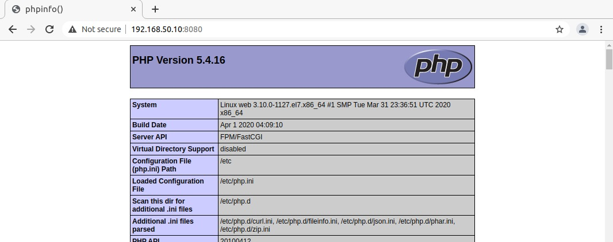
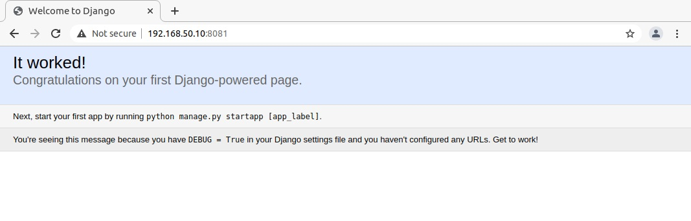
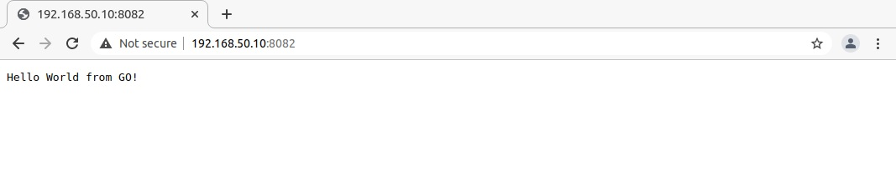

# Lesson 37 (Dynamic Web)


## Задача

```
Развертывание веб приложения.

Цель:

Варианты стенда:

* nginx + php-fpm (laravel/wordpress) + python (flask/django) + js(react/angular)
* nginx + java (tomcat/jetty/netty) + go + ruby 
* можно свои комбинации

Реализации на выбор:

* на хостовой системе через конфиги в /etc
* деплой через docker-compose

Для усложнения можно попросить проекты у коллег с курсов по разработке.

К сдаче принимается vagrant стенд с проброшенными на локалхост портами каждый порт на свой сайт через нжинкс.
```

## Решение

Решением являемся настроеный стенд vagrantfile разворачиваемый с помощью [Ansible](playbook.yml).

Структура стенда:

**Nginx**
* PHP-FPM - порт 9000
* Django - порт 8000
* GO - порт 3000


```
# ss -ltunp

Netid State		Recv-Q Send-Q	Local 	Address:Port 		Peer	Address:Port              
tcp   LISTEN     0      128		        127.0.0.1:3000    	*:*     users:(("hello",pid=7079,fd=3)) 
tcp   LISTEN     0      10				127.0.0.1:8000		*:*     users:(("python",pid=6931,fd=4))
tcp   LISTEN     0      128				127.0.0.1:9000  	*:* 	users:(("php-fpm",pid=7160,fd=0),("php-fpm",pid=7159,fd=0),("php-fpm",pid=7158,fd=0),("php-fpm",pid=7157,fd=0),("php-fpm",pid=7156,fd=0),("php-fpm",pid=7155,fd=6))
```


Сервисы доступны по адресам:

* PHP - http://192.168.50.10:8080
* Django - http://192.168.50.10:8081
* GO - http://192.168.50.10:8082


```
# ss -ltunp

Netid State		Recv-Q Send-Q	Local 	Address:Port 		Peer	Address:Port  

tcp   LISTEN     0      128    			*:8080  			*:*		users:(("nginx",pid=7006,fd=11),("nginx",pid=7005,fd=11))
tcp   LISTEN     0      128             *:8081				*:*		users:(("nginx",pid=7006,fd=9),("nginx",pid=7005,fd=9))
tcp   LISTEN     0      128				*:8082				*:*		users:(("nginx",pid=7006,fd=10),("nginx",pid=7005,fd=10))
```






