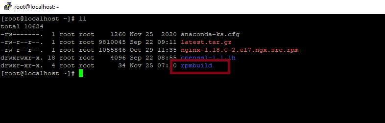
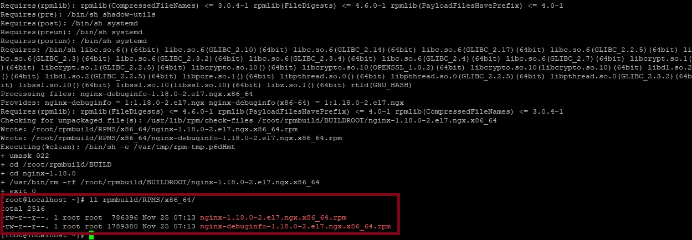
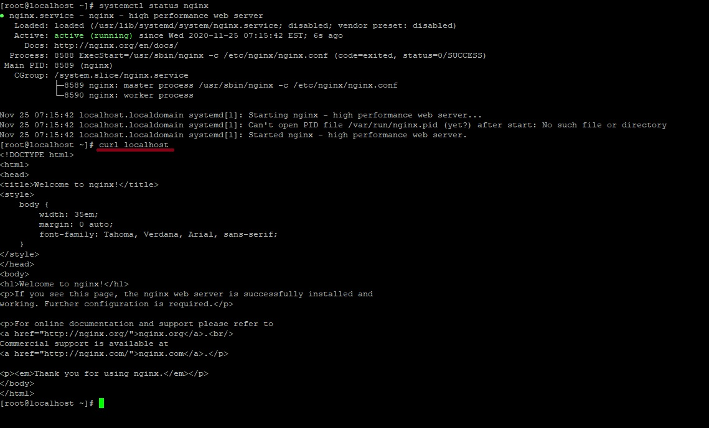
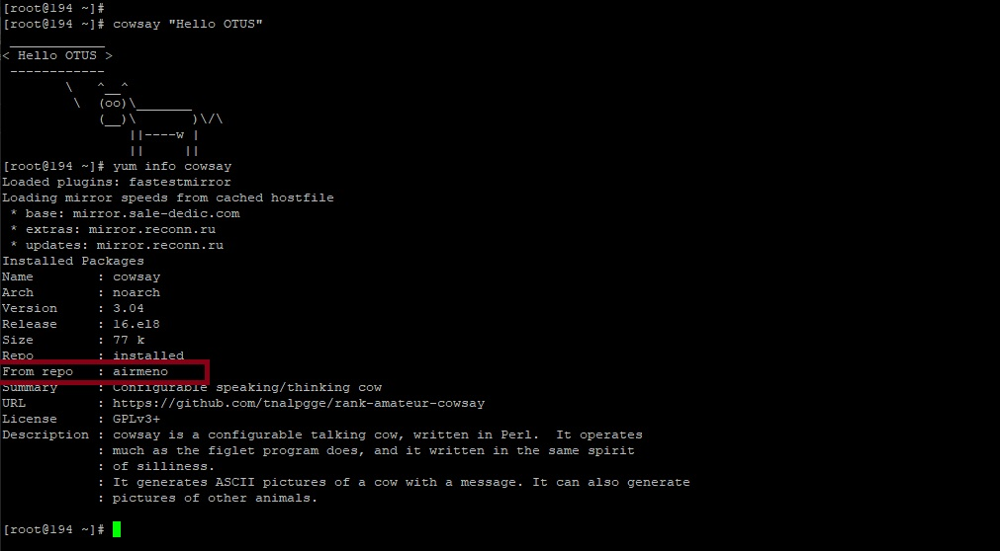

# Lesson 6 (Make / RPM / YUM и чуть Docker)

### 1. Работа с RPM 

Установим пакеты для работы с rpm пакетами:
```
yum install -y redhat-lsb-core wget rpmdevtools rpm-build createrepo yum-utils gcc
```

Собираем свой пакет на NGINX с поддержкой openssl. Загрузим необходимые пакеты: SRPM пакет NGINX и OpenSSL:
```
wget https://nginx.org/packages/centos/7/SRPMS/nginx-1.18.0-2.el7.ngx.src.rpm 
wget https://www.openssl.org/source/latest.tar.gz

tar -xvf latest.tar.gz
```
Уставим и проверим создалась ли папка:
```
rpm -i nginx-1.18.0-2.el7.ngx.src.rpm
ll
```

Добавим опцию SSL при сборке NGINX - в /root/rpmbuild/SPECS/nginx.spec в блоке %build добавим --with-openssl=/root/openssl-1.1.1h

```
%build
./configure %{BASE_CONFIGURE_ARGS} \
    --with-cc-opt="%{WITH_CC_OPT}" \
    --with-ld-opt="%{WITH_LD_OPT}" \
    --with-debug \
    --with-openssl=/root/openssl-1.1.1h
```
Установим все зависимости для сборки:
```
yum-builddep rpmbuild/SPECS/nginx.spec
```
и собирем совой пакет RPM:
```
rpmbuild -bb rpmbuild/SPECS/nginx.spec

ll rpmbuild/RPMS/x86_64/
```


Установим rpm пакет и запустим nginx:
```
yum localinstall -y rpmbuild/RPMS/x86_64/nginx-1.18.0-2.el7.ngx.x86_64.rpm

systemctl start nginx
systemctl status nginx
```

Проверим работу NGINX:
```
curl localhost
```


### 2. Создаем свой репозитарий

Папка на веб-сервере для репозитория 
```
mkdir /usr/share/nginx/html/repo
```
Скопируем готовый NGINX+SSL rpm в папку репозитория. И туда же скачаем простой rpm пакет для установки с нашего репозитория:
```
cp /root/rpmbuild/RPMS/x86_64/nginx-1.18.0-2.el7.ngx.x86_64.rpm /usr/share/nginx/html/repo/

wget https://download-ib01.fedoraproject.org/pub/epel/testing/8/Everything/x86_64/Packages/c/cowsay-3.04-16.el8.noarch.rpm -O /usr/share/nginx/html/repo/cowsay-3.04-16.el8.noarch.rpm 
```
Инициализируем репозиторий:
```
createrepo /usr/share/nginx/html/repo/
```

В /etc/nginx/conf.d/default.conf в секции location / добавим директиву autoindex on
```
location / {
root /usr/share/nginx/html;
index index.html index.htm;
autoindex on;
}
```
Проверка синтаксиса и перезапуск:
```
nginx -t && nginx -s reload
curl -a http://repo.airmeno.ru/repo/
```

### 3. Установка пакетов из нашего репозитория

Добавим репозиторий в систему: 
```
cat >> /etc/yum.repos.d/airmeno.repo << EOF
[airmeno]
name=airmeno-repo
baseurl=http://repo.airmeno.ru/repo
gpgcheck=0
enabled=1
EOF
```

Проверим, что наш репозиторий добавился и пакеты присутствуют:
```
yum repolist enabled | grep airmeno
yum list | grep airmeno
```

Установим пакет cowsay:
```
yum install cowsay -y
```
Проверим запуск: 
```
cowsay "Hello OTUS"
```
Проверим откуда он установлен
```
yum info cowsay
```


Откроем порты для http 
```
firewall-cmd --permanent --add-service=http
firewall-cmd --reload
```

Наш репозитрой доступен по адресу [http://repo.airmeno.ru/repo/](http://repo.airmeno.ru/repo/)
